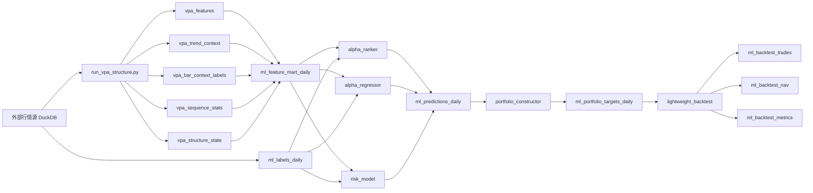
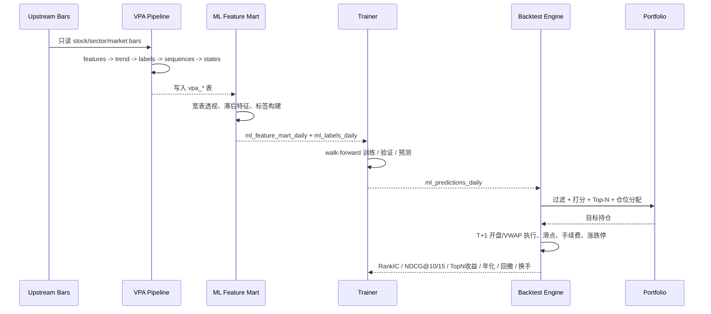

# 构建量价分析增强型机器学习选股系统工程设计规范

## 执行摘要

本次研究先使用已启用的 GitHub 连接器审查了 `miraclecn/volume-price-analysis` 仓库，并以该仓库为核心构建工程设计。现有仓库已经形成了比较清晰的上游边界：原始行情下载、前复权、PIT 参考数据、ST/停牌/涨跌停修复等由外部系统负责；本仓库通过只读适配器读取外部 DuckDB，再生成项目自有的 `vpa_features`、`vpa_trend_context`、`vpa_bar_context_labels`、`vpa_sequence_stats`、`vpa_structure_state` 等派生表，并导出 Excel 报告。仓库当前包名为 `vpa-structure-recognizer`，要求 Python 3.11 及以上。fileciteturn8file0L5-L10 fileciteturn8file0L42-L56 fileciteturn9file0L3-L10

从代码而不是仅从文档看，当前 pipeline 的执行顺序已相当稳定：读取个股日线，派生板块与全市场聚合 bars，计算百分比特征，生成父窗口趋势背景，生成单日量价标签，做多日序列统计，识别结构状态，自上而下评分，再把结果写回 DuckDB 并导出报告。也就是说，VPA 仓库已经是一个**合格的上游结构化特征生成器**，而不是一个未定义的数据概念草图。fileciteturn27file0L31-L69 fileciteturn27file0L69-L115

因此，最合理的工程方案不是重写一套“机器学习版量价系统”，而是在现有仓库旁边新增一个**低耦合的下游 ML 子系统**：VPA 继续只负责生成 `vpa_*` 表；ML 子系统只读消费这些表，构建 `ml_*` 表、训练 LightGBM Ranker / 回归 / 风险模型、生成持仓 10–15 只的组合信号，并用一个轻量级回测子系统做 walk-forward 验证。这种方案与当前仓库的架构边界天然一致，也最有利于未来单独拆 repo。fileciteturn8file0L5-L10 fileciteturn31file0L7-L12 fileciteturn31file0L15-L26

在标签哲学上，本报告的核心判断是：**要把“客观量价事实”与“威科夫派生解释”分层建模**。仓库 SPEC 已明确要求单日标签只能描述量价事实，不能直接把单根 K 线定义成吸筹、派发、洗盘、主力建仓等主观结论；而 `POSSIBLE_ACCUMULATION` / `POSSIBLE_DISTRIBUTION` 只能由多窗口序列与趋势位置共同判断。这个原则非常正确，应该完整继承到 ML 子系统里：底层客观量价标签做主特征，威科夫派生标签做辅助特征或消融层，而未来收益、未来最大涨幅/回撤、横截面排名才是监督学习目标。fileciteturn3file0L137-L174 fileciteturn5file0L10-L27 fileciteturn22file0L76-L89 fileciteturn40file0L34-L63

在模型层面，针对“每天只买 10–15 只股票”的约束，**LightGBM Ranker 应当是主模型**。LightGBM 官方文档明确支持 `lambdarank` 目标、`group` 查询分组、`ndcg` 评估、`eval_at` 和 `lambdarank_truncation_level`；其中 truncation level 与目标 `NDCG@k` 直接相关，建议略高于目标 k，这非常契合“从每天全市场中挑出前 10–15 名”的问题定义。回归模型适合作为并行的收益/收益回撤综合分模型，风险模型适合作为未来回撤概率过滤器。citeturn3view0turn4view0turn4view2turn4view4

最后，在验证与回测层面，本报告不建议直接复用一个重型外部框架，而建议围绕本项目的数据契约新建一个**轻量级回测子系统**。它必须支持：每日 top-N 选股、行业与流动性约束、滑点和手续费、涨跌停处理、T+1 执行模拟、walk-forward 验证，以及 `RankIC`、`NDCG@10/15`、TopN 收益、年化、最大回撤、盈亏比、换手率、弱市表现等指标。尤其要避免决策时点泄露：如果特征来自 T 日收盘后可得信息，则执行基准应为 T+1 开盘或 T+1 VWAP，而不是把 T 日收盘后的信息“挪回”到同日开盘执行。近期关于金融回测“decision-time leakage”的研究表明，同日开盘执行和使用盘后才知道的信息，都会显著抬高表观表现。fileciteturn28file0L11-L35 citeturn14academia1

## 仓库现状与设计边界

### 当前仓库已经实现的边界

`volume-price-analysis` 的 README 明确写出：仓库**不负责原始市场数据准备**，而是通过只读适配器读取外部 DuckDB，并把派生结果写入项目自有 `vpa_*` 表和报表目录；生成数据只应保存在 `outputs/` 下，不能回写上游 DuckDB。这个边界对于后续增加 ML 子系统非常关键，因为它天然鼓励“读上游、写自有表”的低耦合模式。fileciteturn8file0L5-L10 fileciteturn8file0L54-L56

实现计划文档进一步把范围边界写得更细：本仓库的 in-scope 是只读外部 DuckDB 适配器、`vpa_*` 派生表、特征工程、多窗口标签、序列模式、结构状态、top-down ranking、Excel 导出和验证指标；而原始下载、复权、PIT 参考构造、交易日历和上游质量修复都被明确列为 out-of-scope。对于未来拆分 repo，这一份边界说明几乎已经等于第一版“接口契约”。fileciteturn31file0L15-L26

### 当前数据流与实现模块

现有 `run_pipeline()` 的主流程是：读取个股 bars → 构造板块/全市场 bars → 计算 `vpa_features` → 计算 `vpa_trend_context` → 生成 `vpa_bar_context_labels` → 分析 `vpa_sequence_stats` → 识别 `vpa_structure_state` → top-down 评分 → 写库 → 生成验证表与 Excel 报告。这个流程说明，VPA 已经形成了“数值特征层 → 客观标签层 → 序列层 → 状态层 → 评级层”的完整链条。fileciteturn27file0L31-L69 fileciteturn27file0L69-L115

从实现文件看，仓库当前已经有 `feature_engineering.py`、`trend_context.py`、`bar_labeler.py`、`sequence_analyzer.py`、`state_classifier.py`、`top_down_ranker.py`、`backtest_validator.py`、`excel_exporter.py` 和 `pipeline.py`。这意味着 ML 子系统不应重写这些逻辑，而应消费这些逻辑的输出。fileciteturn27file0L10-L21

### 当前输入、输出与表结构

仓库已经定义了规范化输入列。个股输入至少包括 `date`、`code`、`open`、`high`、`low`、`close`、`prev_close`、`volume`、`amount`、`turnover_rate`、`is_st`、`is_paused`、`limit_up`、`limit_down`、`industry_code`、`industry_name`；板块与全市场也有独立的规范列。`ResearchSourceDuckDB` 通过只读连接从 `daily_bar_pit`、`tradeability_state_daily`、`industry_classification_pit` 规范化出这些列。fileciteturn4file0L7-L30 fileciteturn17file0L5-L22 fileciteturn18file0L21-L40 fileciteturn18file0L59-L90

仓库当前实际建出的 DuckDB 表包括 `vpa_features`、`vpa_trend_context`、`vpa_bar_context_labels`、`vpa_sequence_stats` 与 `vpa_structure_state`，主键分别是 `(date, scope_type, scope_id, window_n)` 或 `(date, scope_type, scope_id)`。SQL 文件已经把字段级 schema 固化下来，这对于下游 ML 特征宽表的 join 规则非常有帮助。fileciteturn13file0L3-L36 fileciteturn13file0L38-L72 fileciteturn13file0L74-L103 fileciteturn13file0L105-L130

### 当前仓库与 ML 之间的关键差距

SPEC 明确写了“第一版只实现结构识别，不做自动交易”，并且“不实现复杂机器学习”。现有 `backtest_validator.py` 本质上仅计算未来收益与未来最大涨幅/回撤等后效字段，供结构后验验证使用，不是一个真正的执行级回测引擎。也就是说，当前仓库离“可交易的 ML 选股系统”只差两段：**面向训练的一行一股票一日期特征宽表**，以及**面向决策的一套评分—组合—执行—回测闭环**。fileciteturn6file0L158-L185 fileciteturn28file0L11-L35

## 目标架构与模块边界

### 推荐架构

建议在当前仓库下新增一个与 `vpa_structure_recognizer` 并列的 `ml_stock_selector` 子系统，而不是把 ML 逻辑直接塞回 `vpa_structure_recognizer`。原因很简单：当前 VPA 已经有非常明显的“上游派生表生成器”定位；而 ML、回测、组合与部署逻辑则是另一类生命周期、另一类试验路径。把两者并列，最容易保持低耦合，也最方便将来抽离。这个建议与 README 的“上游只读、下游项目自有表输出”的现有边界一致。fileciteturn8file0L5-L10



这张特征流图的核心约束只有一句话：**VPA 只写 `vpa_*`；ML 只读 `vpa_*`，并只写 `ml_*`**。不允许 ML 子系统直接依赖上游 DuckDB 的领域表名，也不允许 VPA 子系统为了迁就模型而侵入式改写结构识别逻辑。现有仓库已经把 `run_pipeline()` 的职责限定在 VPA 侧，因此这个边界可以自然落地。fileciteturn27file0L31-L69

### 建议目录结构

下面的结构保留现有 VPA 包与脚本，同时新增 ML、回测与服务层。现有仓库已有 `config/default.toml`、`scripts/run_vpa_structure.py` 和 `vpa_structure_recognizer/*`；新增目录应尽量做 sibling，而不是嵌套侵入。fileciteturn11file0L3-L18 fileciteturn32file0L13-L35 fileciteturn31file0L38-L60

| 路径 | 角色 | 关键文件 |
|---|---|---|
| `vpa_structure_recognizer/` | 现有上游 VPA 子系统 | `feature_engineering.py` `bar_labeler.py` `sequence_analyzer.py` `state_classifier.py` |
| `ml_stock_selector/` | 新增 ML 子系统 | `feature_mart.py` `label_builder.py` `alpha_ranker.py` `alpha_regressor.py` `risk_model.py` |
| `ml_stock_selector/backtest/` | 轻量回测子系统 | `engine.py` `execution.py` `constraints.py` `metrics.py` `walkforward.py` |
| `ml_stock_selector/portfolio/` | 组合构建 | `scorer.py` `constructor.py` `allocator.py` |
| `ml_stock_selector/serving/` | 每日推理与信号落库 | `daily_signal.py` `artifact_loader.py` |
| `scripts/` | CLI 入口 | `run_ml_feature_mart.py` `train_ml_models.py` `run_ml_backtest.py` `run_ml_daily_signal.py` |
| `config/` | 配置 | `ml_default.toml` `ml_backtest.toml` `ml_live.toml` |
| `sql/` | DDL / ETL | `create_ml_tables_postgres.sql` `create_ml_tables_sqlite.sql` |
| `tests/` | 测试 | `test_ml_feature_mart.py` `test_label_builder.py` `test_alpha_ranker.py` `test_backtest_engine.py` |

### 建议依赖

现有实现计划里已经明确技术栈是 Python、DuckDB Python API、pandas/openpyxl、pytest，并倾向少依赖。ML 子系统建议只在这个基础上谨慎增加少量必要依赖。fileciteturn31file0L7-L12

| 依赖 | 用途 | 建议级别 |
|---|---|---|
| `lightgbm` | Ranker / 回归 / 风险分类主模型 | 必需 |
| `scikit-learn` | 时间切分、指标、校准 | 必需 |
| `duckdb` | 直接读取现有 `vpa.duckdb` | 必需 |
| `pandas` `numpy` `pyarrow` | 特征宽表与列式 IO | 必需 |
| `sqlalchemy` | 若启用 PostgreSQL | 可选 |
| `typer` 或 `click` | 改善 CLI | 可选 |
| `pydantic` | 配置校验与表契约对象 | 可选 |
| `matplotlib` | 回测图表输出 | 可选 |

## 数据契约与标签分层

### 现有 VPA 契约与新增 ML 契约

仓库现有模式非常适合“表驱动式”扩展。`vpa_features` 存数值百分比特征，`vpa_trend_context` 存父窗口背景，`vpa_bar_context_labels` 存单日客观量价标签，`vpa_sequence_stats` 存多日序列统计，`vpa_structure_state` 存阶段和 top-down 评分。这个层次已经形成天然的数据契约。fileciteturn4file0L129-L206 fileciteturn4file0L244-L270 fileciteturn4file0L292-L330 fileciteturn4file0L334-L362 fileciteturn5file0L1-L8

建议新增的 `ml_*` 表如下。第一版不需要很多花哨的表，只要能把训练、预测、回测、组合四条链闭合即可。

| 表名 | 粒度 | 主要字段 | 用途 |
|---|---|---|---|
| `ml_feature_mart_daily` | 一行=股票+日期 | `trade_date` `code` `industry_code` + 宽表特征列 | 训练/推理主特征表 |
| `ml_labels_daily` | 一行=股票+日期+预测周期 | `trade_date` `code` `horizon_d` `future_ret` `future_max_gain` `future_max_drawdown` `rank_pct` `rank_label` | 监督标签 |
| `ml_train_samples` | 一行=股票+日期+实验版本 | `dataset_id` `fold_id` `trade_date` `code` `feature_set` `label_name` | 可复现实验切片 |
| `ml_model_registry` | 一行=模型版本 | `model_id` `model_type` `params_json` `train_range` `valid_range` `artifact_uri` | 模型治理 |
| `ml_predictions_daily` | 一行=股票+日期+模型 | `trade_date` `code` `model_id` `alpha_score` `risk_score` `trade_score` | 每日预测输出 |
| `ml_portfolio_targets_daily` | 一行=组合目标 | `trade_date` `portfolio_id` `code` `target_weight` `entry_reason` | 投资组合目标权重 |
| `ml_backtest_orders` | 一行=订单 | `sim_date` `code` `side` `qty` `order_px_ref` `fill_px` `status` | 执行模拟 |
| `ml_backtest_positions` | 一行=日期+持仓 | `sim_date` `code` `position_qty` `market_value` `weight` | 持仓快照 |
| `ml_backtest_nav` | 一行=日期 | `sim_date` `nav` `cash` `gross_exposure` `turnover` | 净值曲线 |
| `ml_backtest_metrics` | 一行=回测实验 | `run_id` `rankic_mean` `ndcg10` `ndcg15` `ann_return` `max_drawdown` `profit_loss_ratio` | 汇总指标 |

### 必须坚持的标签分层

现有 SPEC 和代码中最宝贵的一点，是把量价系统天然分成了不同解释层。对于机器学习，建议强制维持四层，并把“人为二次标注偏差”当作一个显式实验变量，而不是隐藏假设。fileciteturn3file0L137-L174 fileciteturn24file0L87-L110 fileciteturn25file0L47-L105

| 层级 | 内容 | 例子 | 是否默认进入主模型 |
|---|---|---|---|
| 数值层 | 百分比/滚动数值 | `ret_pct_10` `range_rvol_20` `ma_slope_60` | 是 |
| 客观标签层 | 单日事实型量价标签 | `NORMAL_UP_CONFIRM_10` `HIGH_VOLUME_UPPER_SUPPLY_20` | 是 |
| 序列层 | 多日统计与模式 | `support_label_count_20` `bull_score_change_60` `LOW_LEVEL_SUPPORT_PATTERN_20` | 是 |
| 派生状态层 | 威科夫解释和 top-down 结论 | `POSSIBLE_ACCUMULATION` `HEALTHY_UPTREND` `final_rating=A` | 默认可选，需做消融 |

这样设计的原因很明确：仓库本身已经要求**单日标签只能描述事实**，例如“放量上涨确认”“高量低进展”“长上影供应增强”等，而不能把单日直接解释成吸筹或派发；同时又允许在多日序列和趋势位置上输出 `POSSIBLE_ACCUMULATION` / `POSSIBLE_DISTRIBUTION`。这正好适合把客观层作为主特征，把解释层作为“可验证增益”的辅助层。fileciteturn3file0L137-L174 fileciteturn5file0L159-L283

### 关于用户希望的 5/10/20/60 多周期标签

当前默认配置是 `[10, 20, 30, 60, 120, 240]`，且 `compute_features()` 会对传入的 `windows` 列表逐窗计算，因此从工程上看，**加 5 日窗口不是架构性变更，只是配置与少量规则扩展**。建议新增一个 ML 使用的 VPA 配置文件，例如 `config/ml_vpa.toml`，将基础窗口改为 `[5, 10, 20, 60, 120, 240]`，并为 `5` 添加父窗口映射。由于现有规则强调“分析某个窗口时必须使用更大窗口看背景”，5 日最合适的父窗口建议是 `20`。fileciteturn11file0L3-L18 fileciteturn33file0L23-L48 fileciteturn19file0L43-L90

这里需要强调：即便主训练标签只预测未来 1/5/10 日收益，**保留 20/60/120/240 乃至 30 日作为背景特征仍然有价值**。现有 SPEC 原本就强调短窗口结构必须借助更大窗口判断趋势背景，这一点非常适合 ML，因为它能把“同样是短线放量上涨，但发生在低位承接阶段还是高位供应阶段”这种上下文差异显式编码出来。fileciteturn3file0L175-L217

### 建议的特征宽表形态

`ml_feature_mart_daily` 的核心原则是：**一行一个股票-日期**。VPA 当前很多表是一行一个 `window_n`，这适合结构识别，但不适合直接训练横截面模型。因此需要把多个 `window_n` 透视成宽表，同时引入有限的时序展开或统计值。

| 特征分组 | 示例列 |
|---|---|
| 基础标识 | `trade_date` `code` `industry_code` `market_regime` |
| 数值特征 | `ret_pct_5` `vol_rvol_10` `range_rvol_20` `ma_slope_60` |
| 客观标签 one-hot | `raw_label_5=LOW_VOLUME_BIG_UP` `raw_label_20=NORMAL_UP_CONFIRM` |
| 标签分数 | `bull_bear_score_5` `supply_score_20` `demand_score_60` |
| 父窗口背景 | `trend_label_20` `position_label_60` |
| 序列统计 | `support_label_count_20` `abnormal_ratio_10` `bull_score_change_60` |
| 派生状态 | `state_10` `state_20` `final_state` `final_rating` |
| 滞后统计 | `bull_bear_score_5_lag1` `demand_score_20_mean_5d` |
| 交易约束 | `is_st` `is_paused` `can_buy_next_open` `adv20_amount` |

### PostgreSQL 与 SQLite 的关键 DDL 示例

当前仓库在 DuckDB 中通过 delete+insert 形式做 upsert；如果未来把 ML 子系统的状态表放到 PostgreSQL 或 SQLite，二者都支持 `INSERT ... ON CONFLICT` 风格的 UPSERT。PostgreSQL 官方文档明确支持 `ON CONFLICT DO NOTHING / DO UPDATE`；SQLite 文档也说明其 UPSERT 语法跟随 PostgreSQL 并做了扩展。fileciteturn12file0L12-L19 fileciteturn12file0L22-L40 citeturn15view0turn16view1

**PostgreSQL 示例**

```sql
CREATE TABLE IF NOT EXISTS ml_predictions_daily (
    trade_date date NOT NULL,
    code text NOT NULL,
    model_id text NOT NULL,
    horizon_d integer NOT NULL,
    alpha_score double precision,
    risk_score double precision,
    trade_score double precision,
    alpha_rank_pct double precision,
    risk_rank_pct double precision,
    context_score double precision,
    feature_set text NOT NULL,
    created_at timestamptz NOT NULL DEFAULT now(),
    PRIMARY KEY (trade_date, code, model_id, horizon_d)
);

INSERT INTO ml_predictions_daily (
    trade_date, code, model_id, horizon_d,
    alpha_score, risk_score, trade_score,
    alpha_rank_pct, risk_rank_pct, context_score, feature_set
) VALUES (
    DATE '2026-05-29', '000001.SZ', 'lgbm_ranker_v1', 5,
    0.8123, 0.2345, 0.6650,
    0.9620, 0.1830, 72.5, 'vpa_obj_seq'
)
ON CONFLICT (trade_date, code, model_id, horizon_d)
DO UPDATE SET
    alpha_score    = EXCLUDED.alpha_score,
    risk_score     = EXCLUDED.risk_score,
    trade_score    = EXCLUDED.trade_score,
    alpha_rank_pct = EXCLUDED.alpha_rank_pct,
    risk_rank_pct  = EXCLUDED.risk_rank_pct,
    context_score  = EXCLUDED.context_score,
    feature_set    = EXCLUDED.feature_set,
    created_at     = now();
```

**SQLite 示例**

```sql
CREATE TABLE IF NOT EXISTS ml_predictions_daily (
    trade_date TEXT NOT NULL,
    code TEXT NOT NULL,
    model_id TEXT NOT NULL,
    horizon_d INTEGER NOT NULL,
    alpha_score REAL,
    risk_score REAL,
    trade_score REAL,
    alpha_rank_pct REAL,
    risk_rank_pct REAL,
    context_score REAL,
    feature_set TEXT NOT NULL,
    created_at TEXT NOT NULL DEFAULT CURRENT_TIMESTAMP,
    PRIMARY KEY (trade_date, code, model_id, horizon_d)
);

INSERT INTO ml_predictions_daily (
    trade_date, code, model_id, horizon_d,
    alpha_score, risk_score, trade_score,
    alpha_rank_pct, risk_rank_pct, context_score, feature_set
) VALUES (
    '2026-05-29', '000001.SZ', 'lgbm_ranker_v1', 5,
    0.8123, 0.2345, 0.6650,
    0.9620, 0.1830, 72.5, 'vpa_obj_seq'
)
ON CONFLICT(trade_date, code, model_id, horizon_d) DO UPDATE SET
    alpha_score    = excluded.alpha_score,
    risk_score     = excluded.risk_score,
    trade_score    = excluded.trade_score,
    alpha_rank_pct = excluded.alpha_rank_pct,
    risk_rank_pct  = excluded.risk_rank_pct,
    context_score  = excluded.context_score,
    feature_set    = excluded.feature_set,
    created_at     = CURRENT_TIMESTAMP;
```

## 模型训练与打分体系

### 训练数据应该如何组织

建议训练样本采用**横截面日频面板**。每个交易日是一组 query/group，组内是当日全市场可交易股票；模型目标不是回答“这只票会不会涨”，而是回答“在今天这组股票里，它是否更值得排进前 10–15 名”。这也是为什么 Ranker 要作为主模型，而不是只做二分类。LightGBM 的 ranking 训练需要 `group` 信息，且样本应按 query/group 排序；其 `lambdarank` 目标与 `ndcg` 指标、`eval_at` 和 `lambdarank_truncation_level` 直接相关。citeturn4view2turn4view3turn4view4turn4view0

当前仓库已经内建了一部分将来可直接复用的监督目标：`future_ret_1d`、`future_ret_3d`、`future_ret_5d`、`future_ret_10d`、`future_ret_20d`、`future_max_gain_10d`、`future_max_drawdown_10d`、`future_max_gain_20d`、`future_max_drawdown_20d`、`hit_new_high_20d` 等。第一步不应把这些逻辑扔掉，而是应把现有 `backtest_validator.py` 升级为 `ml/label_builder.py` 的核心标签构造器，再补齐 `5d` 路径标签。fileciteturn6file0L127-L156 fileciteturn28file0L8-L35 fileciteturn28file0L38-L60

### 建议的监督标签

最推荐的标签不是单一的“未来 5 日收盘收益”，而是一个分层标签体系：

| 标签 | 类型 | 定义 | 主要用途 |
|---|---|---|---|
| `future_ret_5d` | 回归 | T 收盘到 T+5 收盘收益 | 基础收益预测 |
| `future_max_gain_5d` | 回归 | T+1..T+5 最高涨幅 | 寻找短线弹性 |
| `future_max_drawdown_5d` | 回归 | T+1..T+5 最大回撤 | 风险建模 |
| `future_score_5d` | 回归 | `future_ret_5d + 0.5*max_gain_5d - 0.7*abs(max_dd_5d)` | 综合收益回撤分 |
| `future_rank_pct_5d` | 回归/排序 | 当日全市场 `future_score_5d` 分位数 | 横截面排序 |
| `rank_label_5d` | 排序 | 将 `future_rank_pct_5d` 分桶为 0..4 | `lambdarank` 监督标签 |
| `risk_label_5d` | 分类 | `future_max_drawdown_5d <= -5%` | 风险分类器 |
| `outperform_market_5d` | 分类 | 是否跑赢全市场等权基准 | 稳健性标签 |

这里的关键点在于：**不要拿 `final_rating` 或 `final_state` 做监督目标**。原因不是这些字段没价值，而是它们本质上是上游规则系统的解释性输出；如果你用它们作为主标签，模型主要学到的是“如何复制既有规则”，不是“量价结构与未来收益之间的统计关系”。仓库自身也把第一版定义成结构识别与后效验证系统，而不是自动交易或复杂 ML 系统。fileciteturn6file0L158-L185

### 建议的模型组合

| 模型 | 目标 | 输入特征集 | 输出 | 备注 |
|---|---|---|---|---|
| `alpha_ranker` | `lambdarank` | 数值层 + 客观标签层 + 序列层 | `alpha_rank_score` | 主模型 |
| `alpha_regressor` | `regression` | 同上 | `future_score_5d_pred` | 作为连续值补充 |
| `risk_model` | `binary` | 同上 + 流动性/波动 | `risk_prob` | 过滤大回撤 |
| `context_model` | 可选 `binary` | 派生状态层 | `context_prob` | 仅在消融后保留 |
| `calibrator` | `isotonic` / `sigmoid` | 预测分数 | 校准后的概率/分位 | 便于组合打分 |

LightGBM 官方支持 `regression`、`binary`、`lambdarank` 和 `rank_xendcg` 目标；`lambdarank` 使用整数相关性标签，`label_gain` 可设置不同等级的 gain；`rank_xendcg` 官方文档还说明它通常更快、性能类似于 `lambdarank`。第一版建议先用 `lambdarank`，因为它与 Top-10/15 的选股目标和 `NDCG@k` 更直观匹配。citeturn3view0turn4view0turn4view4

### 特征集的基线与消融

这部分是回答“人为二次标注会不会伤害机器学习”的关键实验设计。建议把特征集明确分成四档，并全部做对照。

| 实验名 | 特征内容 | 目的 |
|---|---|---|
| Baseline A | 仅 OHLCV 数值 + 基本技术数值 | 传统基线 |
| Baseline B | A + `vpa_features` 数值项 | 量价数值增强 |
| VPA C | B + `vpa_bar_context_labels` 客观标签与分数 | 验证客观量价语言的增益 |
| VPA D | C + `vpa_sequence_stats` | 验证序列结构增益 |
| VPA E | D + `vpa_structure_state` / `final_state` / `final_rating` | 验证威科夫派生解释是否真正有增益 |

如果 VPA E 在训练/验证集很好，但在真正的 out-of-sample walk-forward 或弱市分段测试里明显失真，那就说明**高层派生状态引入了偏见或过强先验**；这时应降级其权重，甚至把它从主模型特征集中移除，只保留为解释层。现有仓库对“单日客观事实”和“多日结构判断”的分层很清晰，非常适合做这种消融。fileciteturn3file0L137-L174 fileciteturn24file0L179-L226 fileciteturn25file0L108-L145

### 建议的 LightGBM 超参数起点

LightGBM 的 ranking 文档明确建议：如果目标是 `NDCG@k`，`lambdarank_truncation_level` 应略高于 `k`；而 `eval_at` 用于指定 `NDCG@k` 的评估位置。这对“持仓 10–15 只”非常关键。citeturn4view0turn4view1

| 模型 | 参数 | 建议起点 | 说明 |
|---|---|---:|---|
| `alpha_ranker` | `objective` | `lambdarank` | 主模型 |
|  | `metric` | `ndcg` | 直对 Top-K |
|  | `eval_at` | `[10,15]` | 对应组合持仓 |
|  | `lambdarank_truncation_level` | `18` | 略高于 15 |
|  | `num_leaves` | `63` | 起点 |
|  | `learning_rate` | `0.05` | 较稳 |
|  | `feature_fraction` | `0.8` | 抑制过拟合 |
|  | `bagging_fraction` | `0.8` | 抑制过拟合 |
|  | `bagging_freq` | `1` | 配合 bagging |
|  | `min_data_in_leaf` | `300` | 横截面 panel 更稳 |
|  | `lambda_l1/l2` | `0.0 / 5.0` | 建议起点 |
| `alpha_regressor` | `objective` | `regression` | 连续分值 |
|  | `metric` | `l2` / `l1` | 视标签稳定性 |
| `risk_model` | `objective` | `binary` | 大回撤风险 |
|  | `metric` | `auc` + `binary_logloss` | 风控更关注排序与校准 |

### 推荐的交易打分公式

现有 top-down ranker 已经把 `market_score * 0.25 + sector_score * 0.30 + stock_score * 0.35 + resonance_score * 0.10` 作为启发式 final score，并在 `market_score < 40` 或 `sector_score < 40` 时下调评级。这个思想值得保留，但不应继续让它直接决定买卖，而应由 ML 的 alpha/risk 结果接管主导权。fileciteturn6file0L37-L47 fileciteturn26file0L21-L31 fileciteturn26file0L67-L95 fileciteturn38file0L20-L69

推荐把最终交易打分定义为：

```text
context_score_pct = 横截面分位数(context_score)
alpha_score_pct   = 横截面分位数(alpha_ranker_pred)
risk_score_pct    = 横截面分位数(risk_model_pred)
liq_score_pct     = 横截面分位数(liquidity_score)

trade_score =
0.60 * alpha_score_pct
+ 0.15 * context_score_pct
+ 0.10 * liq_score_pct
+ 0.05 * relative_strength_pct
+ 0.10 * resonance_pct
- 0.30 * risk_score_pct
- penalty_score
```

其中 `penalty_score` 可包含：不可交易惩罚、过度高开惩罚、行业过度集中惩罚、与已有持仓高度相似惩罚等。这个公式的用意是：**保留 VPA 上游对环境与结构的解释能力，但让真正的未来收益预测在分数里占主导**。

### 建议的 Python API / CLI

现有仓库已经有比较简洁的 VPA CLI；ML 子系统建议保持同样风格。现有 VPA CLI 参数包括 `--config`、`--start-date`、`--end-date`、`--as-of-date`、`--source`、`--output-db` 和 `--output-dir`。fileciteturn32file0L13-L35

| 文件 | 接口签名示例 | 用途 |
|---|---|---|
| `ml_stock_selector/feature_mart.py` | `build_feature_mart(vpa_db_path: str, start_date: str, end_date: str, windows: list[int]) -> pd.DataFrame` | 宽表构建 |
| `ml_stock_selector/label_builder.py` | `build_labels(price_source: str, start_date: str, end_date: str, horizons: list[int]) -> pd.DataFrame` | 标签生成 |
| `ml_stock_selector/alpha_ranker.py` | `train_alpha_ranker(frame: pd.DataFrame, label_col: str, group_col: str, params: dict) -> ModelArtifact` | 排序模型 |
| `ml_stock_selector/risk_model.py` | `train_risk_model(frame: pd.DataFrame, label_col: str, params: dict) -> ModelArtifact` | 风险模型 |
| `ml_stock_selector/portfolio/scorer.py` | `score_candidates(preds: pd.DataFrame, context: pd.DataFrame, constraints: dict) -> pd.DataFrame` | 交易分值 |
| `ml_stock_selector/backtest/engine.py` | `run_backtest(predictions: pd.DataFrame, bars: pd.DataFrame, config: BacktestConfig) -> BacktestResult` | 回测引擎 |
| `scripts/run_ml_feature_mart.py` | CLI | 生成 `ml_feature_mart_daily` |
| `scripts/train_ml_models.py` | CLI | 训练与验证 |
| `scripts/run_ml_backtest.py` | CLI | walk-forward 回测 |
| `scripts/run_ml_daily_signal.py` | CLI | 每日信号落库 |

## 组合构建与轻量回测

### 组合构建原则

既然目标是“持仓 10–15 只”，就不应该把模型输出当成“全市场都可买”的评分，而应显式地让组合约束参与决策。建议默认策略为：**最多持有 12 只，最多不超过 15 只；没有足够高分标的时允许低仓或空仓；同一行业最多 3 只；单只股票权重通常 6%–10%；不能强迫模型每天买满。** 这个原则与现有 top-down ranker 的“弱市场和弱板块要降级”“逆势个股仅观察”是一致的，只是从评级层推进到了组合层。fileciteturn26file0L67-L95 fileciteturn38file0L39-L69

建议在组合构建器里把约束拆成三类：  
其一是**硬过滤**，例如 `is_st`、`is_paused`、次日涨停买不到、成交额过低、退市风险等；  
其二是**软惩罚**，例如行业过度集中、与已有持仓高度相似、异常高开；  
其三是**仓位控制**，例如根据市场环境或 `market_score` 调节总仓位。仓库现有输入契约已经提供了 `is_st`、`is_paused`、`limit_up`、`limit_down`、`industry_code` 等字段，因此这些约束大部分都能在工程上直接落地。fileciteturn17file0L5-L22 fileciteturn18file0L59-L90

### 轻量回测子系统的职责

当前仓库的 `backtest_validator.py` 只负责生成未来收益/回撤字段，不负责真实的交易执行模拟。新的轻量回测子系统应该只做五件事：  
一是读 `ml_predictions_daily` 和原始 bar；  
二是按规则构建目标组合；  
三是模拟 T+1 执行；  
四是维护持仓与净值；  
五是输出统一指标矩阵。  
不需要一开始就做多资产、多账户、撮合级事件驱动框架；因为你的核心问题是“VPA 特征是否能稳定改进 Top-10/15 选股表现”，不是“做一个通用交易平台”。fileciteturn28file0L11-L35



### 回测参数建议表

| 参数 | 建议默认值 | 说明 |
|---|---:|---|
| `max_positions` | 12 | 目标持仓数 |
| `max_positions_hard` | 15 | 绝对上限 |
| `min_score_threshold` | 0.80 | 低于阈值不买 |
| `max_new_entries_per_day` | 4 | 控换手 |
| `max_industry_names` | 3 | 控行业集中 |
| `min_adv20_amount` | 自定义，如 5000 万 | 流动性门槛 |
| `fee_bps` | 3 | 0.03%/笔 |
| `slippage_bps` | 5 | 0.05%/笔 |
| `execution_ref` | `next_open` | 避免时点泄露 |
| `rebalance_freq` | `daily` | 每日重评分 |
| `max_holding_days` | 5 或 10 | 依标签 horizon 而定 |
| `stop_loss_pct` | -0.05 | 风险底线 |
| `take_profit_rule` | 可选 | 例如回撤止盈 |

### 训练、验证、测试时间切分示例

用户要求示例时间范围为 2018–2025。建议至少做两套验证：一套标准 walk-forward，一套带 horizon-size embargo 的严格版本。之所以需要 embargo，是因为 5 日、10 日标签天然存在时间重叠；在金融任务里，这类重叠若不处理，很容易导致过于乐观的表现估计。citeturn14search2turn14search6turn14academia1

| 折 | 训练集 | 验证集 | 测试集 | 备注 |
|---|---|---|---|---|
| Fold A | 2018–2020 | 2021 | 2022 | 初次建模 |
| Fold B | 2018–2021 | 2022 | 2023 | 向前滚动 |
| Fold C | 2018–2022 | 2023 | 2024 | 向前滚动 |
| Fold D | 2018–2023 | 2024 | 2025 | 向前滚动 |
| Strict A | 同上 | 同上 | 同上 | 在 train/valid/test 交界处增加 5–10 日 embargo |

### 指标体系

LightGBM ranking 与持仓 Top-10/15 的目标天然匹配，所以建议把评估指标分成三层：  
第一层是**预测层**：`RankIC`、`NDCG@10`、`NDCG@15`；  
第二层是**组合层**：Top10/Top15 组合未来 5d/10d 平均收益、胜率、盈亏比；  
第三层是**交易层**：年化、最大回撤、月胜率、换手率、成本后收益、弱市表现。  
`ndcg`、`eval_at` 本身就是 LightGBM 官方 ranking 场景的标准指标。citeturn4view0turn4view1

另外，建议新增两个“困难指标”：  
其一是**弱市表现**，即在 `market_score < 40` 或全市场下跌月内的组合回撤与收益；  
其二是**约束后命中率**，即经过行业/流动性/时点过滤后仍进入最终组合的预测命中率。因为很多看似很强的模型，实际一加约束就全部失效。

## 风险控制、验证方案与实施路线

### 主要风险与缓解措施

| 风险 | 表现 | 缓解措施 |
|---|---|---|
| 人为二次标注偏差 | `final_state` / `final_rating` 在样本内很好，样本外失真 | 把派生解释层单独做消融；主模型默认只用数值层+客观标签层+序列层 |
| 标签泄露 | 用 T 日收盘后信息却按 T 日开盘成交；未来区间重叠污染验证 | 固定 T+1 开盘/VWAP 执行；walk-forward + embargo；增设 every-5th-day 子样本回测 |
| 样本选择偏差 | 只训练高评级股票，模型不知道差样本长什么样 | 训练集覆盖全市场可交易股票，而不是仅 VPA 候选池 |
| 样本不平衡 | 真正强势股只占很少比例 | Ranker 用分桶相关性标签；风险模型用 class weight / focal ideas |
| 过拟合 | 派生状态层太强、参数搜索太多 | 记录所有实验；限制搜索空间；固定 baseline + ablation |
| 序列重叠 | 5 日/10 日 horizon 导致相邻标签高度相关 | embargo、非重叠抽样复验、统计显著性区间 |
| 交易成本忽略 | 回测看起来很好，实盘被换手吞噬 | 强制成本后报表；限制 `max_new_entries_per_day`；按真实涨跌停状态执行 |
| 流动性假象 | 小票预测强但买不进卖不出 | ADV20/换手率过滤；成交量参与率限制 |
| 决策时点污染 | 同日开盘/收盘误用未来信息 | 全部统一成“收盘决策，次日执行”参考系 | 

其中“决策时点污染”必须被单独重视。近期金融 ML 回测研究专门指出，在 daily bar 设定下，特征构造、交易时点和执行价格稍微改动，就会系统性抬高表现；因此建议把“clean reference protocol”写进测试规范，而不是靠研究人员自觉。citeturn14academia1

### Baseline、消融与统计验证

建议至少做以下实验矩阵：

| 实验组 | 特征 | 模型 | 目标 |
|---|---|---|---|
| Baseline A | OHLCV 基础数值 | Ranker | `rank_label_5d` |
| Baseline B | A + `vpa_features` 数值项 | Ranker | `rank_label_5d` |
| VPA C | B + 客观 bar label | Ranker | `rank_label_5d` |
| VPA D | C + sequence stats | Ranker | `rank_label_5d` |
| VPA E | D + 派生 state/rating | Ranker | `rank_label_5d` |
| Risk A | C/D/E | Binary | `risk_label_5d` |

验证时不要只看一次回测。至少应输出：  
每个 fold 的 `RankIC`、`NDCG@10/15`、TopN 成本后收益；  
按年份、按牛熊环境、按行业集中度的切片表现；  
以及对组合日收益序列做 block bootstrap 置信区间。  
如果做了大量超参数与特征集搜索，还应记录 trial 数量，并对“挑出来的最好结果”做额外的多重试验修正检查。选择偏差与 backtest overfitting 是金融 ML 的系统性问题，而不是细枝末节。citeturn17search0turn17search2turn14academia4

### 可直接落地的阶段划分与里程碑

| 阶段 | 目标 | 产出 | 预计验收 |
|---|---|---|---|
| 阶段一 | 固化数据契约 | `ml_feature_mart_daily` `ml_labels_daily` DDL 与构造脚本 | 能从 `vpa.duckdb` 生成可训练宽表 |
| 阶段二 | 跑通主模型 | `alpha_ranker` `risk_model` + 单 fold 报告 | 训练/验证/测试全链路可复现 |
| 阶段三 | 跑通轻量回测 | `ml_predictions_daily` → 组合 → 净值 | T+1 执行 + 成本后净值正确 |
| 阶段四 | 完成消融矩阵 | Baseline A/B + VPA C/D/E | 明确客观量价标签的增益位置 |
| 阶段五 | 每日推理化 | `run_ml_daily_signal.py` + artifact registry | 可日更产出目标组合 |
| 阶段六 | 拆分准备 | DB 契约、artifact 契约、无侵入依赖 | 可以独立 repo 化 |

### 关键验收标准示例

下面给出的是**工程验收阈值示例**，不是理论保证值；目的是让系统是否“值得继续投入”有一个客观门槛。

| 维度 | 示例阈值 |
|---|---|
| 数据完整性 | `ml_feature_mart_daily` 主键重复率 = 0；缺失率报表齐全 |
| 标签完整性 | `future_ret_5d`、`future_max_gain_5d`、`future_max_drawdown_5d` 覆盖率 > 99% |
| 预测层 | 2024–2025 walk-forward `RankIC` 月均值 > 0.015；正 `RankIC` 月份占比 > 55% |
| 排名层 | `NDCG@10` 至少较 Baseline A 提升 10%；`NDCG@15` 至少提升 8% |
| 组合层 | Top15 成本后年化收益显著高于 Baseline A；盈亏比 > 1.2 |
| 风控层 | 成本后最大回撤不高于 Baseline A 的 80% |
| 执行层 | 年均换手率在预设范围内；涨跌停处理与实际规则一致 |
| 稳健性 | 弱市子样本中相对基线回撤改善明显，至少不出现“模型只在强市有效” |
| 治理层 | 任意一个模型结果都能追溯到 `model_id`、参数、训练区间与特征集 |

### 未来拆分为独立 repo 的迁移步骤

当前最合适的组织方式仍是**挂在现有 VPA 仓库下作为子系统**，因为现阶段频繁试验会不断推动 `window_n`、标签构造和后验验证字段的小调整；过早拆仓库，会把这些试验成本放大。现有 README 与实现计划都已经把 VPA 的边界清楚地限定为“上游只读、项目自有派生表”，这为日后拆分提供了稳定的抽象层。fileciteturn8file0L5-L10 fileciteturn31file0L15-L26

建议的拆分顺序如下：

| 步骤 | 动作 | 结果 |
|---|---|---|
| 第一步 | 在同 repo 内完成 `ml_stock_selector`，但**禁止**直接 import 上游数据源适配器 | 耦合仅发生在 `vpa_*` 表契约 |
| 第二步 | 把 `vpa_*` 契约写成独立文档与版本号 | 建立 schema contract |
| 第三步 | 把模型 artifact、`ml_*` 表、CLI 固定下来 | 建立 serving/backtest contract |
| 第四步 | 把 `ml_stock_selector` 提取为独立包/独立 repo | VPA 与 ML 分治 |
| 第五步 | 通过 DuckDB/Parquet/PostgreSQL 视图而非 Python import 交换数据 | 完全解耦 |

如果到那时仍希望兼容 SQLite / PostgreSQL，那么建议让独立 repo 的**训练入口仍然优先读取 DuckDB/Parquet**，而把 PostgreSQL 作为在线状态库、SQLite 作为本地开发和单机回测存储。这样既尊重了现有仓库已经采用的 DuckDB 列式分析路径，也满足了未来服务化的数据库需求。现有仓库已经把 DuckDB 初始化、schema 创建与 upsert 策略集中在 `storage.py` 和 `sql/create_vpa_tables.sql`，这正适合在拆分时复制“契约而非实现”。fileciteturn12file0L12-L19 fileciteturn13file0L3-L36

总体上，这个系统最稳妥、最可落地的工程哲学可以归结为一句话：

**让 VPA 负责把 OHLCV 翻译成多周期量价语言，让 ML 负责学习这种语言与未来收益/风险之间的统计关系，让回测负责把预测变成受约束、可执行、可验证的 10–15 只股票组合。** 现有仓库已经完成了前半句，本 spec 的目标就是把后半句工程化地补齐。fileciteturn3file0L31-L44 fileciteturn27file0L31-L69