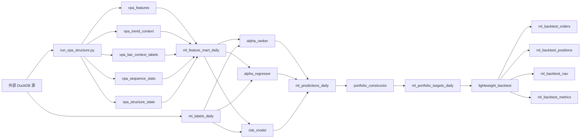
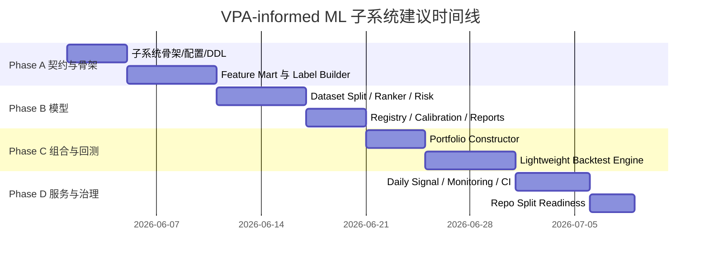

# 量价分析增强型机器学习选股系统实施研究

## 执行摘要

已启用连接器：**GitHub**。本次研究以用户指定仓库 **`miraclecn/volume-price-analysis`** 为起点，结合仓库源码与文档、LightGBM 官方文档、PostgreSQL / SQLite 官方 UPSERT 文档，以及近期关于金融回测决策时点泄露的论文，形成一份可直接落地的工程设计规范与 Codex `/goal` 任务拆分文档。另参考了本轮会话中已上传的前序设计草案，作为术语与边界定义的补充链接。citeturn4view0turn5view0turn16view0turn25view0turn26view1turn13academia1 fileciteturn0file0

核心结论只有三条。第一，**不要把 ML 做成对现有 VPA 规则系统的侵入式改造**；现有仓库已经天然具备“上游结构化量价特征生成器”的形态，最合理的方案是在同一 repo 下新增一个 **低耦合的 `ml_stock_selector` 子系统**，只读消费 `vpa_*` 表，只写自己的 `ml_*` 表。现有 README 已明确规定：项目不负责原始数据准备，只从外部 DuckDB 只读读取并写出项目自有 `vpa_*` 派生表，而且所有生成数据都应留在 `outputs/` 下，不能回写上游数据源。citeturn5view0turn41view0

第二，**主模型应当是横截面排序模型，而不是“涨跌二分类”**。LightGBM 官方明确支持 `lambdarank`、`rank_xendcg`、`binary`、`regression` 等目标；`LGBMRanker` 要求提供 query / group 数据，`eval_at` 用于指定 `NDCG@k` 的评估位置，`lambdarank_truncation_level` 与目标 `NDCG@k` 紧密相关，并建议略高于目标 `k`。这与“每天从全市场里选出 10–15 只最好股票”的问题定义是天然匹配的。回归模型和风险分类模型可以保留，但应作为并行模型，而不是主任务替代品。citeturn16view0turn16view1turn17view2turn18view0turn18view1

第三，**回测模块应新建轻量子系统，而不是把现有 `backtest_validator.py` 当成真实交易回测器**。当前仓库中的 `backtest_validator.py` 负责的是后验验证字段计算：`future_ret_{1,3,5,10,20}d`、`future_max_gain_{10,20}d`、`future_max_drawdown_{10,20}d`、`hit_new_high_20d`、`outperform_market_10d` 等；它并不模拟组合构建、订单执行、涨跌停、T+1、滑点与手续费。因此，ML 子系统应新建一个面向 **10–15 只持仓** 的轻量回测引擎。尤其要把“**T 日收盘决策、T+1 执行**”写成硬规则，因为近期论文显示，同日开盘执行或把盘后才知道的信息混入同日交易，会系统性抬高金融 ML 回测表现。citeturn36view0turn36view2turn36view4turn13academia1

## 以仓库现状为起点的设计边界

当前仓库并不是一个泛泛的“想法草图”，而是一条已经可运行的 VPA pipeline。`README.md` 说明了范围：仓库实现的是 **A 股多层级量价结构识别系统**；它只读外部 DuckDB，写出项目自有的 `vpa_features`、`vpa_trend_context`、`vpa_bar_context_labels`、`vpa_sequence_stats`、`vpa_structure_state` 等 DuckDB 表，并生成 Excel 报告；测试入口是 `python -m pytest tests -v`，主流程入口是 `scripts/run_vpa_structure.py`。`pyproject.toml` 还表明现有包名是 `vpa-structure-recognizer`，要求 Python `>=3.11`。citeturn5view0turn6view0

从 `pipeline.py` 的执行顺序可以看得更清楚：当前流程先从只读数据源读取个股 bars，再构造成交行业 bars 和全市场 bars，然后计算 `compute_features()`，再计算 `compute_trend_context()`、`label_bars()`、`analyze_sequences()`、`classify_structure_states()`，最后经过 `rank_top_down()` 产出分数并写回 `vpa_*` 表。也就是说，VPA 层已经拥有非常清晰的数据血缘：**原始 bars → 百分比数值特征 → 父窗口背景 → 客观单日量价标签 → 多日序列统计 → 派生结构状态 → top-down 评分**。这正是 ML 子系统最理想的上游接口。citeturn9view1turn9view5

现有 DuckDB schema 已经足够稳定，适合被下游消费。`vpa_features` 包含 `ret_pct`、`range_pct`、`body_pct`、`upper_shadow_pct`、`lower_shadow_pct`、`vol_rvol_n`、`range_rvol_n`、`price_position_n`、`ma_n`、`ma_slope_n` 等数值特征；`vpa_trend_context` 包含 `parent_window_n`、`parent_high`、`parent_low`、`trend_label`、`position_label`、`trend_strength_score`；`vpa_bar_context_labels` 包含 `raw_label`、`normal_or_abnormal`、`volume_level`、`price_result_level`、`efficiency_level`、`bull_bear_score`、`supply_score`、`demand_score`；`vpa_sequence_stats` 包含 `support_label_count`、`supply_label_count`、`high_volume_stall_count`、`low_volume_pullback_count`、`bull_score_change`、`sequence_pattern`；`vpa_structure_state` 则包含多窗口状态、`final_state`、`market_score`、`sector_score`、`self_score`、`relative_strength_score`、`resonance_score`、`final_rating` 等字段。citeturn30view0turn29view1turn29view2turn30view0

仓库对“客观标签”和“派生解释”的分层尤其重要。VPA SPEC 明确规定：`POSSIBLE_ACCUMULATION` / `POSSIBLE_DISTRIBUTION` 这种高层状态**不能由单日标签直接生成**，只能由多窗口序列和趋势位置共同判断；单日规则则应保持为“`NORMAL_UP_CONFIRM`”“`HIGH_VOLUME_LOW_PROGRESS`”“`HIGH_VOLUME_UPPER_SUPPLY`”“`HIGH_VOLUME_LOWER_SUPPORT`”这类**客观量价事实**。这一点非常值得继承到 ML：默认主特征应以数值层、客观标签层、序列统计层为主；把 `final_state` / `final_rating` 作为可选增强层，而不是第一天就作为主监督或唯一主特征。citeturn6view6turn10view5turn39view0turn37view2

另外，当前配置并不包含 5 日窗口，默认窗口是 `[10, 20, 30, 60, 120, 240]`，父窗口映射是 `10→[30,60]`、`20→[60]`、`30→[120]`、`60→[240]`。但因为 `pipeline.py` 和 `compute_features()` 本身就是按 `config.windows` 驱动，多加一个 `5` 并不是架构级变更，而是配置与少量父窗口映射扩展。ML 子系统完全可以在不破坏现有 VPA 的前提下，引入一个单独配置，例如 `config/ml_vpa.toml`，把窗口扩展为 `[5, 10, 20, 60, 120, 240]`，并把 5 日父窗口设为 20 日。citeturn31view0turn9view1turn40view0

## 工程设计规范

**推荐目录结构**如下。该结构把 `ml_stock_selector` 作为与 `vpa_structure_recognizer` 并列的子系统，维持同 repo、强边界、弱耦合；这与现有仓库的“上游只读、项目自有表落地、`outputs/` 内自洽”的边界是一致的。citeturn5view0turn41view0

```text
volume-price-analysis/
├── config/
│   ├── default.toml
│   ├── ml_default.toml
│   ├── ml_backtest.toml
│   └── ml_live.toml
├── scripts/
│   ├── run_vpa_structure.py
│   ├── run_ml_feature_mart.py
│   ├── train_ml_models.py
│   ├── run_ml_backtest.py
│   └── run_ml_daily_signal.py
├── sql/
│   ├── create_vpa_tables.sql
│   └── create_ml_tables.sql
├── vpa_structure_recognizer/
│   └── ...
├── ml_stock_selector/
│   ├── __init__.py
│   ├── config.py
│   ├── storage.py
│   ├── feature_mart.py
│   ├── label_builder.py
│   ├── datasets.py
│   ├── registry.py
│   ├── scoring.py
│   ├── models/
│   │   ├── alpha_ranker.py
│   │   ├── alpha_regressor.py
│   │   ├── risk_model.py
│   │   └── calibrator.py
│   ├── portfolio/
│   │   ├── constructor.py
│   │   ├── constraints.py
│   │   └── allocator.py
│   ├── backtest/
│   │   ├── engine.py
│   │   ├── execution.py
│   │   ├── metrics.py
│   │   └── reports.py
│   └── serving/
│       ├── artifact_loader.py
│       └── daily_signal.py
└── tests/
    ├── test_ml_feature_mart.py
    ├── test_ml_label_builder.py
    ├── test_alpha_ranker.py
    ├── test_portfolio_constructor.py
    ├── test_backtest_engine.py
    └── test_ml_pipeline_smoke.py
```

**架构图**建议如下。这里的关键约束只有一句：**VPA 不能 import ML；ML 不能绕过 `vpa_*` 直接绑定上游原始库表名**。运行时的唯一数据交换界面是 `outputs/vpa.duckdb` 中的 `vpa_*` 表，以及可选的 Parquet 导出。citeturn5view0turn9view1turn30view0



**数据契约**建议分成两层。第一层是现有 `vpa_*` 表，作为 Canonical upstream feature contract；第二层是新增 `ml_*` 表，作为训练、预测、组合和回测 contract。现有 `vpa_*` 的定义已经在仓库 SQL 中被固定，且 `storage.py` 用统一的 schema 初始化和 delete+insert upsert 流程维护这些表。对于 ML，第一版建议新增以下核心表：`ml_feature_mart_daily`、`ml_labels_daily`、`ml_dataset_splits`、`ml_model_registry`、`ml_predictions_daily`、`ml_portfolio_targets_daily`、`ml_backtest_orders`、`ml_backtest_positions`、`ml_backtest_nav`、`ml_backtest_metrics`。citeturn30view0turn29view1turn29view2turn41view0turn8view11

下表是**现有 `vpa_*` 契约与 ML 使用方式**。表中内容直接来自当前仓库 DDL 与 pipeline 路径。citeturn30view0turn29view1turn29view2turn36view0

| 表名 | 主键 | 关键字段 | ML 用法 |
|---|---|---|---|
| `vpa_features` | `(date, scope_type, scope_id, window_n)` | `ret_pct` `range_pct` `body_ratio` `close_position` `vol_rvol_n` `ma_slope_n` | 数值层主特征 |
| `vpa_trend_context` | `(date, scope_type, scope_id, window_n)` | `parent_window_n` `trend_label` `position_label` `trend_strength_score` | 背景与位置特征 |
| `vpa_bar_context_labels` | `(date, scope_type, scope_id, window_n)` | `raw_label` `bull_bear_score` `supply_score` `demand_score` | 客观量价标签层 |
| `vpa_sequence_stats` | `(date, scope_type, scope_id, window_n)` | `support_label_count` `supply_label_count` `bull_score_change` `sequence_pattern` | 序列统计层 |
| `vpa_structure_state` | `(date, scope_type, scope_id)` | `state_10..240` `final_state` `market_score` `sector_score` `final_rating` | 派生解释层、环境层 |

**`ml_feature_mart_daily`** 应采用“一行=股票+日期”的宽表范式。所有 `window_n` 级别的 `vpa_*` 行都需要透视成列，例如：`ret_pct_5`、`ret_pct_10`、`vol_rvol_20`、`raw_label_60`、`support_label_count_20`、`trend_label_60`、`position_label_60`、`state_20`。此外要单独补两类列：其一是交易约束列，例如 `is_st`、`is_paused`、`limit_up_next_open_flag`、`adv20_amount`；其二是 lineage 列，例如 `feature_set_id`、`vpa_data_version`、`generated_at`。现有数据源适配器已经标准化输出了 `is_st`、`is_paused`、`limit_up`、`limit_down`、`industry_code`、`industry_name` 等字段，因此这类约束列完全可以在 feature mart 阶段补齐。citeturn32view0turn32view3

**标签体系**建议分三层。第一层是收益类：`future_ret_1d`、`future_ret_5d`、`future_ret_10d`。第二层是路径类：`future_max_gain_5d`、`future_max_drawdown_5d`、`future_max_gain_10d`、`future_max_drawdown_10d`。第三层是横截面类：`future_score_5d`、`future_rank_pct_5d`、`rank_label_5d`、`risk_label_5d`。当前仓库的 `backtest_validator.py` 已经计算了 `future_ret_{1,3,5,10,20}d`、`future_max_gain_{10,20}d`、`future_max_drawdown_{10,20}d` 等后验字段，因此推荐直接把它重构为 `label_builder.py` 的下层函数，并补上 5 日 max gain / drawdown 与横截面 rank label 即可。citeturn36view0turn36view2turn36view4

**特征哲学**必须写死在规范里：默认主特征使用 **数值层 + 客观标签层 + 序列层**，对 `vpa_structure_state.final_state` 和 `final_rating` 采用“先消融、后纳入”的策略。理由是仓库内的阶段状态是通过多窗口结构和位置背景进一步抽象的：例如 `state_classifier.py` 会把多窗口 `window_state` 透视后再计算 `final_state`，而 `POSSIBLE_ACCUMULATION` 需要“低位或中低位 + 至少两个低位支撑/衰竭证据”。如果这些高层状态一开始就重权进入模型，模型很可能只是学会“复制上游规则”，而不是学习真实收益与风险。citeturn37view0turn37view2turn6view6

**模型族**建议采用 “1 主 2 辅” 结构：主模型是 `alpha_ranker`，目标是 `rank_label_5d` 或 `future_rank_pct_5d`；辅助模型一是 `alpha_regressor`，预测 `future_score_5d`；辅助模型二是 `risk_model`，预测 `risk_label_5d` 或 `future_max_drawdown_5d <= -5%`。LightGBM 文档明确说明：`objective` 可以是 `lambdarank`、`rank_xendcg`、`regression`、`binary`；`rank_xendcg` 速度更快且表现与 `lambdarank` 类似，但第一版更建议以 `lambdarank` 为主，因为其与 Top-K 目标和 `NDCG@k` 更直接。`LGBMRanker.fit()` 需要 `group` / `eval_group` 参数，且 `sum(group) = n_samples`。citeturn16view0turn17view2turn17view6turn18view2

**训练 / 验证 / 测试切分**建议以 **walk-forward 为主、purged / embargo 为强化**。原因很直接：1/5/10 日 horizon 的标签天然会重叠，相邻样本并不独立；若只做普通年度切分，容易高估模型表现。推荐最小实现是年度 walk-forward，例如 `2018–2020 train / 2021 valid / 2022 test`，随后向前滚动；推荐增强实现是在 train-valid-test 边界加 `max(horizon)` 天 embargo。金融 ML 中，purging / embargo 的核心目的就是减少标签形成区间重叠带来的信息泄露。citeturn19search0turn21search6turn13academia1

**LightGBM 参数起点**建议如下。参数依据官方文档中对 `lambdarank_truncation_level`、`eval_at`、`label_gain` 的定义进行设置。持仓目标是 10–15 只，因此推荐 `eval_at=[10,15]`，`lambdarank_truncation_level=18`。citeturn18view0turn18view1turn17view6

```toml
[model.alpha_ranker]
objective = "lambdarank"
metric = "ndcg"
eval_at = [10, 15]
lambdarank_truncation_level = 18
lambdarank_norm = true
label_gain = [0, 1, 3, 7, 15]
learning_rate = 0.05
num_leaves = 63
min_data_in_leaf = 300
feature_fraction = 0.8
bagging_fraction = 0.8
bagging_freq = 1
lambda_l2 = 5.0
num_iterations = 600
early_stopping_rounds = 80

[model.alpha_regressor]
objective = "regression"
metric = "l2"
learning_rate = 0.05
num_leaves = 63
min_data_in_leaf = 300
feature_fraction = 0.8
lambda_l2 = 5.0
num_iterations = 600
early_stopping_rounds = 80

[model.risk_model]
objective = "binary"
metric = ["auc", "binary_logloss"]
learning_rate = 0.05
num_leaves = 31
min_data_in_leaf = 500
feature_fraction = 0.8
bagging_fraction = 0.8
bagging_freq = 1
num_iterations = 500
early_stopping_rounds = 60
```

**打分公式**建议明确区分模型分、上下文分和惩罚项。因为仓库现有 `top_down_ranker.py` 已经有 `market_score * 0.25 + sector_score * 0.30 + stock_score * 0.35 + resonance * 0.10` 的 top-down 权重，并在 `market_score < 40` 或 `sector_score < 40` 时做降级，所以 ML 子系统不应把这些分数扔掉，而应把它们转成“环境与风险修正”。推荐公式如下：citeturn38view0turn38view2

```text
alpha_pct   = cross_section_rank_pct(alpha_ranker_pred)
risk_pct    = cross_section_rank_pct(risk_model_pred)
context_pct = cross_section_rank_pct(context_score)
liq_pct     = cross_section_rank_pct(liquidity_score)

trade_score =
0.60 * alpha_pct
+ 0.15 * context_pct
+ 0.10 * liq_pct
+ 0.05 * relative_strength_pct
+ 0.10 * resonance_pct
- 0.30 * risk_pct
- penalty_score
```

**组合约束**应当与“最多 10–15 只股票”的现实约束直接对接，而不是后置。默认建议：`target_positions=12`，`hard_max_positions=15`，`max_industry_names=3`，`max_new_entries_per_day=4`，`single_name_min_weight=0.05`，`single_name_max_weight=0.10`，`allow_cash=true`。与现有仓库的 top-down 思路一致，若市场和板块都偏弱，组合应允许少买甚至不买；不应为了满足“机械满仓”而强迫买入低质量候选。现有 top-down 逻辑里，当 `market_score < 40` 或 `sector_score < 40` 会下调评级，并对“个股强于板块”的情况加上“逆势个股，仅观察”的风险提示，这些原则可直接转化为组合层 hard filter 或 soft penalty。citeturn38view0turn38view2turn38view3

**轻量回测子系统**必须是执行级，而不是仅做后验字段注释。建议 API 约束如下。这里特别强调：交易所、佣金、印花税、滑点口径都属于 **unspecified**，因此第一版只给默认接口，不在 spec 中写死交易所专属规则。若运行环境提供 next-day intraday 数据，可支持 `next_vwap`；否则默认 clean reference 使用 `next_open`。这一点必须严守，是因为近期关于金融回测的研究表明，评估协议只要从 `t+1-open` 切到“用 post-open 信息去做 same-day-open 执行”，结果就会显著膨胀。citeturn36view0turn13academia1

```python
@dataclass
class BacktestConfig:
    start_date: str
    end_date: str
    initial_cash: float
    target_positions: int = 12
    hard_max_positions: int = 15
    max_industry_names: int = 3
    max_new_entries_per_day: int = 4
    single_name_min_weight: float = 0.05
    single_name_max_weight: float = 0.10
    min_trade_score: float = 0.80
    fee_bps: float = 3.0          # unspecified default
    slippage_bps: float = 5.0     # unspecified default
    execution_ref: str = "next_open"  # next_open | next_vwap
    max_holding_days: int = 5
    stop_loss_pct: float | None = -0.05

def run_backtest(
    predictions: pd.DataFrame,
    bars: pd.DataFrame,
    tradeability: pd.DataFrame,
    industry_map: pd.DataFrame,
    config: BacktestConfig,
) -> BacktestResult: ...
```

**评估指标**建议分三层。预测层看 `RankIC`、`NDCG@10`、`NDCG@15`；组合层看 `Top10/Top15` 成本前后未来 5/10 日收益、胜率、盈亏比；交易层看年化、最大回撤、换手率、成本后收益、月度正收益占比、弱市表现。把 `NDCG@10/15` 设为核心指标是有理论与实现上的双重原因：LightGBM ranking 直接围绕 `ndcg` 和 `eval_at` 工作，而 NDCG@k 本身就是经典的 top-k 排序度量。citeturn18view1turn27academia0

**序列化格式与数据血缘**建议采用“三层存储”。分析 canonical store 使用 DuckDB：`outputs/vpa.duckdb` + `outputs/ml.duckdb`。可移植训练快照使用 partitioned Parquet：`outputs/ml/parquet/feature_mart/yyyymm=`。人类调试导出允许 CSV / Excel，但只限 sample 或报告层，不能作为系统真相源。所有 `ml_*` 表都应附带 lineage 字段：`data_version`、`feature_set_id`、`label_version`、`split_id`、`model_id`、`artifact_uri`、`created_at`。现有仓库已把 “schema 初始化 + upsert + output DB 路径” 设计为统一模式，因此 ML 子系统应复制这种 contract-first 方式，而不是引入隐式文件散落。citeturn41view0turn5view0

**核心 `ml_*` DDL 示例**如下。这里选用 PostgreSQL 语法风格书写，因为用户要求考虑 PostgreSQL / SQLite；与此同时，SQLite 官方明确说明其 UPSERT 跟随 PostgreSQL 语法并做扩展，而 PostgreSQL 官方 `INSERT` 文档也明确支持 `ON CONFLICT DO NOTHING / DO UPDATE`。citeturn25view0turn26view1

```sql
CREATE TABLE IF NOT EXISTS ml_feature_mart_daily (
    trade_date date NOT NULL,
    code text NOT NULL,
    industry_code text,
    feature_set_id text NOT NULL,
    vpa_data_version text NOT NULL,
    adv20_amount double precision,
    is_st boolean,
    is_paused boolean,

    ret_pct_5 double precision,
    ret_pct_10 double precision,
    ret_pct_20 double precision,
    ret_pct_60 double precision,

    vol_rvol_5 double precision,
    vol_rvol_10 double precision,
    vol_rvol_20 double precision,
    vol_rvol_60 double precision,

    bull_bear_score_5 double precision,
    bull_bear_score_10 double precision,
    bull_bear_score_20 double precision,
    bull_bear_score_60 double precision,

    supply_score_5 double precision,
    demand_score_5 double precision,
    supply_score_20 double precision,
    demand_score_20 double precision,

    raw_label_5 text,
    raw_label_10 text,
    raw_label_20 text,
    raw_label_60 text,

    trend_label_20 text,
    trend_label_60 text,
    position_label_20 text,
    position_label_60 text,

    support_label_count_20 integer,
    supply_label_count_20 integer,
    bull_score_change_20 double precision,
    sequence_pattern_20 text,

    final_state text,
    market_score double precision,
    sector_score double precision,
    self_score double precision,
    relative_strength_score double precision,
    resonance_score double precision,

    created_at timestamptz NOT NULL DEFAULT now(),
    PRIMARY KEY (trade_date, code, feature_set_id)
);

CREATE TABLE IF NOT EXISTS ml_labels_daily (
    trade_date date NOT NULL,
    code text NOT NULL,
    horizon_d integer NOT NULL,
    label_version text NOT NULL,
    future_ret double precision,
    future_max_gain double precision,
    future_max_drawdown double precision,
    future_score double precision,
    future_rank_pct double precision,
    rank_label integer,
    risk_label integer,
    outperform_market integer,
    created_at timestamptz NOT NULL DEFAULT now(),
    PRIMARY KEY (trade_date, code, horizon_d, label_version)
);

CREATE TABLE IF NOT EXISTS ml_model_registry (
    model_id text PRIMARY KEY,
    model_type text NOT NULL,
    feature_set_id text NOT NULL,
    label_version text NOT NULL,
    split_id text NOT NULL,
    train_range text NOT NULL,
    valid_range text NOT NULL,
    test_range text NOT NULL,
    params_json jsonb NOT NULL,
    metrics_json jsonb NOT NULL,
    artifact_uri text NOT NULL,
    is_active boolean NOT NULL DEFAULT false,
    created_at timestamptz NOT NULL DEFAULT now()
);

CREATE TABLE IF NOT EXISTS ml_predictions_daily (
    trade_date date NOT NULL,
    code text NOT NULL,
    model_id text NOT NULL,
    horizon_d integer NOT NULL,
    alpha_score double precision,
    risk_score double precision,
    trade_score double precision,
    alpha_rank_pct double precision,
    risk_rank_pct double precision,
    context_rank_pct double precision,
    created_at timestamptz NOT NULL DEFAULT now(),
    PRIMARY KEY (trade_date, code, model_id, horizon_d)
);

CREATE TABLE IF NOT EXISTS ml_portfolio_targets_daily (
    trade_date date NOT NULL,
    portfolio_id text NOT NULL,
    code text NOT NULL,
    target_weight double precision NOT NULL,
    target_rank integer NOT NULL,
    entry_reason text,
    created_at timestamptz NOT NULL DEFAULT now(),
    PRIMARY KEY (trade_date, portfolio_id, code)
);

CREATE TABLE IF NOT EXISTS ml_backtest_nav (
    run_id text NOT NULL,
    sim_date date NOT NULL,
    nav double precision NOT NULL,
    cash double precision NOT NULL,
    gross_exposure double precision NOT NULL,
    daily_ret double precision,
    turnover double precision,
    drawdown double precision,
    created_at timestamptz NOT NULL DEFAULT now(),
    PRIMARY KEY (run_id, sim_date)
);
```

**`ml_default.toml` 示例**如下。注意：计算资源、交易所、佣金与滑点真实口径均为 **unspecified**，此处仅提供第一版默认值。citeturn31view0turn18view0turn18view1

```toml
[windows]
base = [5, 10, 20, 60, 120, 240]

[windows.parent_map]
"5"   = [20]
"10"  = [30, 60]
"20"  = [60]
"60"  = [240]
"120" = [240]
"240" = [240]

[labels]
horizons = [1, 5, 10]
primary_horizon = 5
risk_drawdown_threshold = -0.05

[dataset]
train_start = "2018-01-01"
train_end   = "2020-12-31"
valid_start = "2021-01-01"
valid_end   = "2021-12-31"
test_start  = "2022-01-01"
test_end    = "2022-12-31"
embargo_days = 10

[feature_set]
include_numeric = true
include_objective_vpa_labels = true
include_sequence_stats = true
include_state_features = false
include_market_context = true

[model.alpha_ranker]
objective = "lambdarank"
metric = "ndcg"
eval_at = [10, 15]
lambdarank_truncation_level = 18
learning_rate = 0.05
num_leaves = 63
min_data_in_leaf = 300
feature_fraction = 0.8
bagging_fraction = 0.8
bagging_freq = 1
lambda_l2 = 5.0
num_iterations = 600
early_stopping_rounds = 80

[model.risk_model]
objective = "binary"
metric = ["auc", "binary_logloss"]
learning_rate = 0.05
num_leaves = 31
min_data_in_leaf = 500
num_iterations = 500
early_stopping_rounds = 60

[portfolio]
target_positions = 12
hard_max_positions = 15
max_industry_names = 3
max_new_entries_per_day = 4
single_name_min_weight = 0.05
single_name_max_weight = 0.10
min_trade_score = 0.80
allow_cash = true

[execution]
ref_price = "next_open"
fee_bps = 3.0
slippage_bps = 5.0

[storage]
ml_database = "outputs/ml.duckdb"
parquet_dir = "outputs/ml/parquet"
artifact_dir = "outputs/ml/artifacts"
report_dir = "outputs/ml/reports"
```

## 关键方案比较与取舍

下表比较 **Ranker / 回归 / 分类** 三种主任务。由于系统目标不是“预测每只股票绝对涨幅”，而是“每天选出最值得买的前 10–15 只”，所以**Ranker 应作为主模型**，回归和分类属于辅助模型。这个选择既符合 LightGBM 官方 ranking 机制，也符合持仓约束带来的业务目标。citeturn16view0turn17view2turn18view0turn18view1

| 方案 | 监督目标 | 优点 | 缺点 | 结论 |
|---|---|---|---|---|
| Ranker | `rank_label_5d` / `future_rank_pct_5d` | 直接优化横截面排序；天然适配 Top-10/15；可直接看 `NDCG@10/15` | 需要 group 组织样本；标签要分桶或排序化 | **主模型** |
| Regressor | `future_score_5d` | 输出连续分，便于后续打分融合 | 绝对收益更噪声；不直接对应 Top-K | 辅助 |
| Classifier | `risk_label_5d` / `top20%` | 易解释；可做风险过滤 | 把排序问题压扁成阈值问题，损失信息 | 风控辅助 |

下表比较 **复用旧回测逻辑 / 引入外部重型框架 / 新建轻量回测子系统**。考虑到当前仓库只有 `compute_validation_metrics()` 这一类“后验标注器”，而没有执行、订单、持仓和净值维护，因此推荐**新建轻量回测子系统**，并且只围绕本仓库的 `vpa_*` 与 `ml_*` 数据契约服务。citeturn36view0turn36view4

| 方案 | 优点 | 缺点 | 结论 |
|---|---|---|---|
| 复用当前 `backtest_validator.py` | 已有未来收益/回撤逻辑 | 不是执行引擎；无组合、订单、成本、涨跌停、T+1 | 不可取 |
| 接入外部重型回测框架 | 功能全 | 高耦合、适配成本大、与现有 DuckDB 契约不匹配 | 第二阶段再评估 |
| 新建轻量回测子系统 | 契约清晰；迭代快；更利于以后拆 repo | 需要自己维护交易执行模块 | **推荐** |

还有一个关键取舍是：**是否让 `final_state` / `final_rating` 一开始就进入主特征集**。从仓库实现看，`final_state` 并不是单日事实，而是多窗口与位置背景的再抽象；例如 `POSSIBLE_ACCUMULATION` 需要低位背景与多窗口支持证据，而 `POSSIBLE_DISTRIBUTION` 依赖高位供应与停滞证据。因此，最佳做法不是禁止使用这些特征，而是把它们放入 **A/B/C/D/E 特征消融矩阵** 中，先验证其样本外增益，再决定是否进入主特征集。citeturn37view0turn37view2turn39view0

建议的消融矩阵如下。这样可以系统回答“人为二次标注会不会伤害机器学习”这个问题，而不是靠直觉。citeturn10view5turn39view0turn37view2

| 实验组 | 特征内容 | 目的 |
|---|---|---|
| Baseline A | OHLCV 基础数值 | 传统基线 |
| Baseline B | A + `vpa_features` 数值项 | 验证量价数值增强 |
| VPA C | B + `vpa_bar_context_labels` | 验证客观量价标签增益 |
| VPA D | C + `vpa_sequence_stats` | 验证序列结构增益 |
| VPA E | D + `vpa_structure_state` | 验证高层派生解释是否过拟合 |

## 详细任务拆分文档

下面给出的是**可直接用于 Codex `/goal` 执行**的任务拆分。每个任务都尽量写成“单次提交就能验收”的粒度，并附上输入、输出、路径、优先级、估时和验收标准。现有仓库已经形成完整的测试分层，`tests/` 下覆盖了 `config`、`features`、`data_sources`、`pipeline_smoke`、`storage_schema`、`backtest_validator`、`top_down_ranker` 等模块，因此 ML 子系统应复用同样的测试文化与命名方式。citeturn33view0turn5view0

| ID | 建议 `/goal` 命令 | 输入 | 输出 | 相关路径 | 优先级 | 估时 | 验收标准 |
|---|---|---|---|---|---:|---:|---|
| G1 | `/goal 在仓库中新增 ml_stock_selector 子系统骨架、config/ml_default.toml、scripts/run_ml_feature_mart.py，不修改现有 vpa_structure_recognizer analytical rules。` | 现有 repo 目录结构 | 新目录与空模块、配置装载器、CLI 骨架 | `ml_stock_selector/*` `config/ml_default.toml` `scripts/run_ml_feature_mart.py` | P0 | 0.5d | `pytest` 不破坏现有测试；新 CLI `--help` 可运行 |
| G2 | `/goal 新增 sql/create_ml_tables.sql 与 ml_stock_selector/storage.py，实现 init_ml_db 和 upsert_dataframe，风格对齐现有 DuckDB storage。` | `create_vpa_tables.sql`、`storage.py` | `ml_*` 表初始化与 upsert | `sql/create_ml_tables.sql` `ml_stock_selector/storage.py` | P0 | 0.5d | 可建表；对主键重复行执行幂等 upsert |
| G3 | `/goal 实现 ml_stock_selector/feature_mart.py：从 outputs/vpa.duckdb 读取 vpa_* 表，构建一行一股票一日期的 ml_feature_mart_daily 宽表。` | `vpa_*` 表 | `ml_feature_mart_daily` | `ml_stock_selector/feature_mart.py` `tests/test_ml_feature_mart.py` | P0 | 1.5d | 宽表主键唯一；列命名一致；5/10/20/60 透视成功 |
| G4 | `/goal 实现 ml_stock_selector/label_builder.py：复用 backtest_validator 思路生成 1/5/10 日收益、最大涨幅、最大回撤、rank_label、risk_label。` | 原始 stock bars / `vpa_structure_state` 日期索引 | `ml_labels_daily` | `ml_stock_selector/label_builder.py` `tests/test_ml_label_builder.py` | P0 | 1.5d | horizon 标签正确；无未来泄露；边界日期缺失处理正确 |
| G5 | `/goal 实现 ml_stock_selector/datasets.py：支持 walk-forward 切分、可选 embargo、group 构造和特征列清单管理。` | `ml_feature_mart_daily` + `ml_labels_daily` | `TrainValidTestSplit` 对象与样本切片 | `ml_stock_selector/datasets.py` `tests/test_ml_datasets.py` | P0 | 1.0d | 切分日期正确；group sum 等于样本数；embargo 生效 |
| G6 | `/goal 实现 alpha_ranker 训练与持久化：基于 LGBMRanker 训练主模型，输出 model artifact、feature importance 和验证指标。` | 数据切片、配置 | `model.txt` `metrics.json` `feature_importance.csv` | `ml_stock_selector/models/alpha_ranker.py` `tests/test_alpha_ranker.py` | P0 | 1.0d | 可训练/预测；记录 `NDCG@10/15`；artifact 可回载 |
| G7 | `/goal 实现 alpha_regressor 与 risk_model，统一 artifact contract，并支持与 alpha_ranker 并行训练。` | 同 G6 | 连续值与风险模型 artifact | `ml_stock_selector/models/alpha_regressor.py` `risk_model.py` | P1 | 1.0d | 二者可独立训练；输出统一 metadata |
| G8 | `/goal 实现 calibrator 与 registry：把原始模型输出转成可比较的横截面分位，并把模型信息写入 ml_model_registry。` | 模型预测值、split 元信息 | 校准器 artifact、registry row | `ml_stock_selector/models/calibrator.py` `registry.py` | P1 | 0.8d | `model_id` 唯一；任意预测可追溯到参数与切分 |
| G9 | `/goal 实现 scoring.py：按 alpha/risk/context/liquidity/penalty 计算 trade_score，并输出 ml_predictions_daily。` | 各模型 raw scores、上下文列 | `ml_predictions_daily` | `ml_stock_selector/scoring.py` `tests/test_scoring.py` | P0 | 1.0d | 排名稳定；分位归一化正确；惩罚项可插拔 |
| G10 | `/goal 实现 portfolio/constraints.py 与 constructor.py：按 10–15 只目标持仓、行业约束、最小分数阈值构造目标组合。` | `ml_predictions_daily`、tradeability、行业映射 | `ml_portfolio_targets_daily` | `ml_stock_selector/portfolio/*` `tests/test_portfolio_constructor.py` | P0 | 1.2d | 不超过行业/持仓上限；允许空仓；排序与阈值行为正确 |
| G11 | `/goal 实现 backtest/execution.py 与 engine.py：支持 T+1 next_open 执行、手续费、滑点、涨跌停/停牌过滤。` | 目标组合、bars、tradeability | 订单、成交、持仓、净值 | `ml_stock_selector/backtest/execution.py` `engine.py` | P0 | 2.0d | same-day 不成交；next_open 成交逻辑正确；成本后 NAV 可复现 |
| G12 | `/goal 实现 backtest/metrics.py 与 reports.py：输出 RankIC、NDCG@10/15、TopN returns、年化、回撤、换手、分年报表。` | 回测结果对象 | `ml_backtest_metrics`、报告文件 | `ml_stock_selector/backtest/metrics.py` `reports.py` | P1 | 1.0d | 指标计算正确；报告可读；按年份切片可输出 |
| G13 | `/goal 实现 serving/daily_signal.py 与 artifact_loader.py：在每日收盘后加载 active model，生成次日目标组合。` | 活跃模型 artifact、最新 `vpa_*` | 当日 `ml_predictions_daily` 与 `ml_portfolio_targets_daily` | `ml_stock_selector/serving/*` `scripts/run_ml_daily_signal.py` | P1 | 1.0d | 当日无训练也可推理；模型缺失时明确报错 |
| G14 | `/goal 补齐 CI、smoke tests 和文档：新增 ml pipeline smoke、schema tests、sample config、README 子章节。` | 全部模块 | 测试、文档、CI 脚本 | `tests/*` `README.md` | P0 | 1.0d | `pytest tests -v` 通过；ML smoke 可跑完整链路 |

为了让 Codex 更容易执行，建议把上表再映射成**按阶段串行执行的 `/goal` 队列**。下面是建议次序；每一步都尽量保持“完成即可合并，且不阻塞下一步测试”。citeturn33view0turn5view0

```text
1. /goal 创建 ml_stock_selector 子系统骨架、配置文件和 CLI 入口，不改动现有 VPA 逻辑
2. /goal 新增 create_ml_tables.sql 与 DuckDB storage 层，实现 ml_* 建表和 upsert
3. /goal 实现 feature_mart 宽表构建，读取 vpa_* 并写入 ml_feature_mart_daily
4. /goal 实现 label_builder，生成 1/5/10d 收益、最大涨幅/回撤与 rank/risk 标签
5. /goal 实现 datasets 切分与 group 组装，支持 walk-forward 和 embargo
6. /goal 实现 alpha_ranker 训练、预测、artifact 持久化
7. /goal 实现 alpha_regressor 与 risk_model，并统一 registry contract
8. /goal 实现 calibration 和 scoring，写出 ml_predictions_daily
9. /goal 实现 portfolio constructor，生成 10–15 只目标组合
10. /goal 实现 lightweight backtest engine，支持 T+1 next_open、滑点、手续费和涨跌停
11. /goal 实现 metrics 和报告，输出 RankIC/NDCG@10/15/TopN/yearly slices
12. /goal 实现 daily signal serving 与 artifact loader
13. /goal 补齐单元测试、集成测试、smoke tests 与 README
```

下面给出**每个阶段的输入/输出契约补充说明**，避免 Codex 在实现时“凭感觉拼接”。这些契约都应写进 docstring 与测试。citeturn30view0turn29view1turn29view2turn36view0

| 阶段 | 输入契约 | 输出契约 | 注意点 |
|---|---|---|---|
| Feature Mart | `vpa_features` / `vpa_trend_context` / `vpa_bar_context_labels` / `vpa_sequence_stats` / `vpa_structure_state` | `ml_feature_mart_daily(trade_date, code, feature_set_id, ...)` | 一行一股票一日期；`scope_type='stock'` 过滤 |
| Label Builder | 原始日线 bars，按 `trade_date, code` 排序 | `ml_labels_daily(trade_date, code, horizon_d, ...)` | 只能使用 `t+1..t+h` 形成标签 |
| Dataset Split | `ml_feature_mart_daily` + `ml_labels_daily` | train/valid/test DataFrame + `group` array | 保证 `sum(group)=n_samples` |
| Training | train/valid frames、config | artifact + registry row | feature 列清单必须固化 |
| Prediction | active model + feature mart | `ml_predictions_daily` | 预测结果要带 `model_id`、`horizon_d` |
| Portfolio | predictions + tradeability + 行业映射 | `ml_portfolio_targets_daily` | 允许少买，不强制满仓 |
| Backtest | targets + bars + config | orders / positions / nav / metrics | 默认 `next_open`，禁止 same-day open |

还需要一份**测试与验收矩阵**。因为现有仓库已经广泛依赖 pytest，ML 子系统不应该走“先开发后补测试”的路径。citeturn33view0turn5view0

| 测试类型 | 覆盖对象 | 最低验收标准 |
|---|---|---|
| Unit Test | feature mart pivot、label math、group builder、score formula、constraints、execution fill | 正确性与边界日期测试齐全 |
| Schema Test | `create_ml_tables.sql` 与 upsert | 幂等建表；主键冲突可 update |
| Integration Test | `run_ml_feature_mart -> train_ml_models -> run_ml_backtest` | 单机 smoke 样本完全可跑通 |
| Leakage Test | 决策信号与成交价时点 | 任何使用 T 日 close 的特征都不能映射到 T 日 open 成交 |
| Regression Test | 固定 sample 数据集上的 metrics snapshot | 小样本结果变化需可解释 |
| Contract Test | `vpa_*` 到 `ml_*` 字段映射 | 缺失关键上游字段时抛明确异常 |

## 实施时间线与未来拆分路线

建议按 **四阶段** 推进，而不是一次性把“训练、回测、在线信号、服务化、拆仓库”全部塞进一个大 PR。现有仓库已经有稳定的 tests、CLI、DuckDB storage 和 schema 文件，意味着最稳妥的策略是先把 `ml_*` contract 立住，再逐步加模型与执行。citeturn5view0turn33view0turn41view0



**第一阶段目标**是 contract-first：落地 `ml_feature_mart_daily`、`ml_labels_daily`、`ml_model_registry` 和 `ml_predictions_daily`，跑通最小版本 `alpha_ranker`。**第二阶段目标**是 decision-first：把 `trade_score -> portfolio_targets -> next_open execution -> nav` 串成闭环。**第三阶段目标**是 governance-first：补齐 artifact 管理、实验追踪、报告与监控。**第四阶段目标**才是 split-first：当 `vpa_*` schema contract 与 `ml_*` serving contract 稳定后，再考虑独立 repo。citeturn5view0turn9view1turn41view0

**未来拆 repo 的标准**建议写成可检查清单，而不是抽象愿景。达成以下四条之一时，就可以认真评估分仓：其一，`vpa_*` schema 六周以上无 breaking change；其二，`ml_model_registry`、artifact 目录结构与 daily signal CLI 已稳定；其三，回测与实盘推理的输入都只依赖 `vpa_*` 视图或 Parquet 快照，而不再 import VPA 内部 Python 模块；其四，ML 团队开始需要独立发版节奏。反之，在早期探索期，把 ML 子系统挂在当前 repo 下仍然是成本最低的做法。这个判断与现有仓库的边界非常一致：它已经把 VPA 定位为“项目自有派生层”，恰好适合做未来 ML repo 的上游 contract source。citeturn5view0turn41view0

如果只保留一句实施建议，那就是：

**让 `vpa_structure_recognizer` 继续专注于把 OHLCV 翻译成多周期量价语言；让 `ml_stock_selector` 专注于学习这些语言与未来 1/5/10 日收益—风险分布之间的关系；让轻量回测子系统专注于把预测变成“10–15 只、可执行、可归因、可复现”的组合结果。** 这正是当前仓库结构、LightGBM ranking 机制和金融回测最佳实践三者的交集。citeturn9view1turn16view0turn18view0turn13academia1