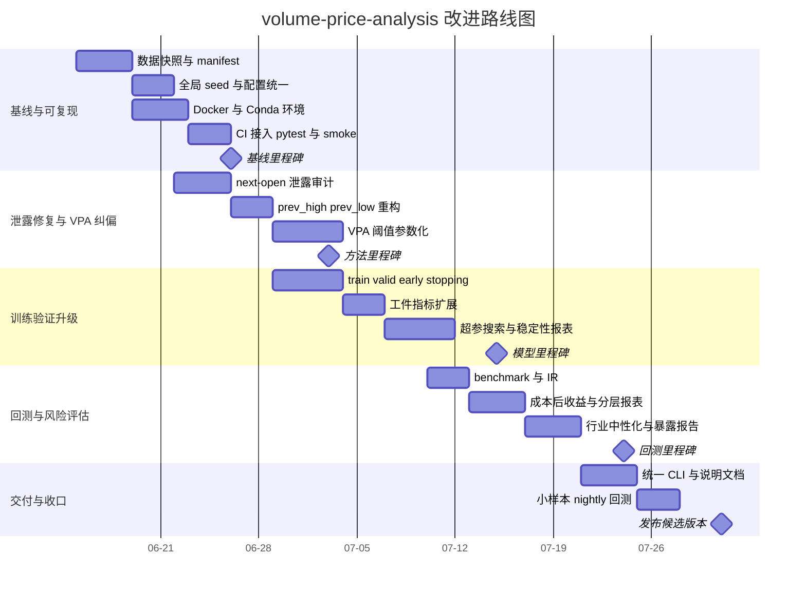

# miraclecn volume-price-analysis 深度审查与改进报告

## 执行摘要

从公开代码树看，这个仓库已经具备相当完整的研究骨架，而不是单纯的量化脚本集合。根目录同时包含 `vpa_structure_recognizer`、`ml_stock_selector`、`scripts`、`tests`、`docs`、`config` 等目录；`scripts` 中已有结构识别、特征仓、walk-forward、回测、批量预测、日信号与 live-sim 入口；`tests` 目录覆盖结构识别、ML、回测、报告与数据合同检查等模块。这说明作者已经在尝试把“量价结构识别 → 特征仓 → 三模型训练 → 组合构建 → 回测/运行时”做成一个连贯系统。citeturn47view0turn47view1turn47view2

但从“专业性、可复现性、可读性、易用性”四个维度审查，它仍更接近**研究原型**，还没有达到可以长期稳定迭代、可严格审计、适合团队协作的生产级研究框架。最关键的问题集中在五类：其一，量价标签与状态判断高度依赖硬编码阈值，且部分突破/跌破语义存在当日窗口混用问题；其二，ML 训练虽然有 walk-forward 骨架，但模型训练阶段没有真正用验证集驱动 early stopping，模型工件记录的也主要是训练集指标；其三，特征/样本构造中存在潜在的数据泄露通道，尤其是 `next_open` 派生出的可交易性标记与 `executable_only=True` 的训练筛样组合；其四，数据版本、随机种子、环境锁定与 CI 门禁不足；其五，评分与回测指标体系已有夏普/Sortino/Calmar 等基础，但未见 benchmark-relative 指标与信息比率闭环。citeturn22view0turn24view1turn29view5turn42view2turn45view5turn34view0turn34view2turn35view4turn46view0turn45view1turn46view1

仓库最值得肯定的地方是：主链路已经串通。`pipeline.py` 把数据读取、特征构造、趋势上下文、bar 标签、序列统计、结构状态分类、分层打分、DuckDB 落表和 Excel 报告导出连成了一条可运行链路；`feature_mart.py` 又把 OHLCV、VPA 序列和结构状态拼成了 ML 特征仓；`tradeability.py` 也已经把 `limit_up`、`limit_down`、`is_paused`、`is_st` 等真实 A 股交易约束纳入数据层，这是正确方向。citeturn22view0turn38view2turn38view4turn21view2turn29view5

我的总体判断是：这个仓库**值得继续投入**，但投入重点不应先放在“再加几个模型”，而应优先放在**泄露修复、验证重构、可复现性、风险调整评估、统一工程接口**五件事上。若只在现有框架上继续堆新因子和新模型，最终很容易得到“回测越来越漂亮、真实泛化越来越差”的结果。金融机器学习文献也一再强调，简单 walk-forward 对过拟合并不总是足够，purged / CPCV 一类验证方法在降低 backtest overfitting 风险上更稳健。citeturn48search3turn31view1

## 仓库审查结论

### 整体结构与优点

仓库结构清晰度高于一般个人量化仓库：根目录公开可见 `vpa_structure_recognizer`、`ml_stock_selector`、`scripts`、`tests`、`docs`、`config`，并且 README 明确说明项目目标是实现“A 股多层级量价结构识别系统”。这说明项目定位不是单一模型，而是一个从量价结构建模到选股评分的体系化工程。citeturn47view0

结构识别侧的主流程在 `vpa_structure_recognizer/pipeline.py` 中相当明确：先从 DuckDB 数据源读取股票日线，再构建申万/行业聚合与全市场聚合，然后计算多窗口特征，继而生成趋势上下文、单 bar 标签、序列统计、结构状态，再做自上而下分层打分，最后写回 DuckDB 并生成 Excel 报告。这个流程链路本身是合理的，也利于后续替换实现。citeturn22view0turn23view1

ML 侧也不是空壳：`ml_stock_selector` 下已经有 `feature_mart.py`、`label_builder.py`、`sample_builder.py`、`split/fold_generator.py`、`models/`、`backtest/`、`portfolio/`、`runtime/` 等完整分层；`scripts/` 中又提供了 `run_ml_feature_mart.py`、`run_ml_walkforward.py`、`run_ml_backtest.py`、`run_ml_daily_signal.py`、`run_live_pipeline.py` 等多个入口。这表明仓库已经具备“研究—训练—回测—模拟运行”的完整闭环雏形。citeturn47view2turn26view0turn26view1turn26view2turn26view3turn26view4turn26view5

另一个明显优点是质量意识并非缺席。`data_sources.py` 会在读数前检查 DuckDB 表和字段合同，并对核心市场字段空值做校验；`tests/` 目录也覆盖了 bar label、data source、backtest engine、metrics、daily signal、feature mart 等多个子系统。也就是说，这个仓库的问题并不是“完全没有工程化意识”，而是**方法学与可复现工程没有完全闭合**。citeturn21view2turn22view1turn47view1

### 数据管线、特征工程与训练流程

VPA 侧的多窗口特征集中在 `vpa_structure_recognizer/feature_engineering.py`：它为每个窗口生成相对量能、波动、实体强弱、区间位置、上/下影线、滚动高低点等特征；`trend_context.py` 则进一步把父窗口趋势映射为 `UPTREND` / `DOWNTREND` / `RECOVERING` / `WEAKENING` / `SIDEWAYS` 等标签；`bar_labeler.py` 再把单日 bar 标记为 `HIGH_VOLUME_LOW_PROGRESS`、`HIGH_VOLUME_UPPER_SUPPLY`、`LOW_VOLUME_BIG_UP`、`BREAKOUT_PULLBACK` 等模式；`sequence_analyzer.py` 和 `state_classifier.py` 则把多窗口、多天信息合成最终的结构状态。这个流水线有相当强的“VPA 语义工程”特征。citeturn22view2turn23view5turn24view0turn24view1turn24view3turn24view5

ML 侧的特征仓由 `feature_mart.py` 统一组织。它先调用 `ohlcv_features.py` 生成基础量价特征，再把 VPA 序列特征与结构状态特征 merge 进来，随后把结果和 tradeability 数据拼装成 `features_json`，并额外携带 `industry_code`、`industry_name`、`adv20_amount`、`can_buy_next_open`、`can_sell_next_open`、`is_bse` 等字段。这里的设计思路是对的：把“能否训练的特征”和“能否执行的约束”都沉淀进统一数据层。问题在于，当前默认版本控制、行业特征默认开关、下一日可交易性信息使用边界，都还不够严格。citeturn38view2turn38view4turn38view5turn29view5

训练侧的主风险出在验证制度。`fold_generator.py` 生成的是按年份划分的 expanding / rolling walk-forward 折；`walkforward.py` 会在每个 fold 上构造 absolute / active / risk 三套样本并训练三类模型；但是 `alpha_ranker.py` 和 `risk_model.py` 在真正 `fit()` 时都会把 `early_stopping_rounds` 从参数中弹掉，而且模型工件指标主要记的是训练集上的 `train_corr`、`train_rank_ic`、`roc_auc`。这意味着折分虽然存在，但**单模型训练阶段并没有真正把 valid fold 变成模型选择器**。LightGBM 官方文档明确支持评估集与 early stopping，因此当前实现实际上放弃了一个本来就应该用起来的核心稳健性工具。citeturn31view1turn45view5turn34view0turn34view2turn35view4turn48search0turn48search8

### 风险与偏差来源

仓库当前最需要警惕的偏差来源，一类来自**时间可观测性边界**。`tradeability.py` 会先把 `next_open`、`next_limit_up`、`next_limit_down`、`next_is_paused` 算出来，再得到 `can_buy_next_open` / `can_sell_next_open`；与此同时，`walkforward.py` 在训练三模型样本时传入了 `executable_only=True`。如果 `_filter_executable()` 使用了这些 next-open 可交易性字段，那么训练样本就会被“事后是否能在下一交易日开盘成交”筛选，这在研究层面属于高风险泄露通道。这里我把它列为**必须优先人工复核**的高优先级问题。citeturn29view5turn42view2turn45view5

另一类来自**标签与阈值硬编码**。例如 `label_builder.py` 用 `future_ret + 0.5 * max_gain - 0.7 * abs(max_drawdown)` 作为 `future_score`；`rank_label` 的区间阈值是 0.99 / 0.95 / 0.90 / 0.70；`trend_context.py` 的趋势判断也依赖固定斜率阈值；`top_down_ranker.py` 与 `scoring.py` 中的市场/行业/个股/共振权重，以及 alpha/context/liquidity/risk 的加权公式，也都是固定写死的。这些做法在起步阶段是常见路径，但若不引入样本外校准、分位数自适应与稳定性检验，它们很容易变成“研究者主观偏好”的编码投影。citeturn29view2turn23view5turn22view5turn23view0turn43view2turn43view3

还有一类来自**可复现性不足**。`feature_mart.py` 当前把 `vpa_data_version` 固定写成 `"v1"`，并以 `generated_at` 记录构建时间；ML 全局配置检索不到 `seed`，而模型配置中的 `random_state` 默认是 `None`；公开根目录树能看到 `tests/`，但未见 `.github/workflows`、Dockerfile 或 conda 环境文件。这些都意味着：同样的代码，不同机器、不同时间、不同依赖状态下，可能得到不同模型或不同结果，却很难追溯到原因。citeturn38view2turn38view5turn29view0turn37view0turn47view0turn47view1

## 问题清单与优先级表

下表按“结构/数据/特征”和“训练/验证/回测”两部分给出详细问题清单。证据列尽量落到具体文件与代码行。

### 结构、数据管线与特征工程问题

| 模块/流程 | 问题与影响 | 维度 | 优先级 | 证据 | 技术改进建议 | 预期收益 | 实施难度 | 必要测试/验证 |
|---|---|---|---|---|---|---|---|---|
| 仓库入口与配置 | `scripts/` 入口非常多，但公开 `config/` 目录仅直观看到 `default.toml`，缺少统一 CLI 与公开默认 ML 配置入口；新成员上手成本高 | 可读性、易用性 | 中 | 根目录与 `scripts/` 可见多个入口；`config/` 目录公开仅见 `default.toml`。`scripts/`: `run_ml_walkforward.py`、`run_ml_backtest.py`、`run_live_pipeline.py` 等。citeturn47view0turn47view2turn13view0 | 统一为 `vpa` CLI；补 `config/ml_default.toml.example`；README 增加最短运行路径 | 降低误操作与维护成本 | 4–12 小时 | `--help` 冒烟测试；新环境从零启动文档演练 |
| 环境与CI | 公开代码树未见 Dockerfile、conda 环境锁定文件、`.github/workflows`；虽然 tests 较多，但缺少自动门禁 | 可复现性、易用性 | 高 | 根目录树可见 `tests/`，但未见 CI/容器文件。citeturn47view0turn47view1 | 增加 Dockerfile、`environment.yml`、GitHub Actions，至少覆盖 lint+pytest+smoke | 保证跨机器一致性与提交门禁 | 1.5–3 人日 | Ubuntu runner 全量 pytest；容器内 smoke backtest |
| 数据版本控制 | `feature_mart.py` 把 `vpa_data_version` 固定写为 `"v1"`，只有 `generated_at`，没有数据快照 hash / 源库版本 / 参数指纹 | 可复现性 | 高 | `ml_stock_selector/feature_mart.py:L945-L951`。citeturn38view2turn38view5 | 引入 DVC 或至少 manifest：源 DuckDB SHA256、日期范围、窗口、git commit、row count | 结果可追溯，可复跑，可比较 | 1–2 人日 | 同输入二次构建 hash 一致；manifest 与 artefact 一一对应 |
| 随机种子治理 | ML 配置检索不到全局 `seed`；模型配置里 `random_state` 默认为 `None` | 可复现性 | 高 | `ml_stock_selector/config.py` 检索不到 `seed`；`ml_stock_selector/models/config.py` 中 ranker/risk `random_state=None`。citeturn29view0turn37view0 | 增加统一 seed 到 config/run context，并传入 Python/NumPy/LightGBM | 多次训练结果可复现，定位问题更容易 | 4–8 小时 | 同一数据、同一 seed 连续 3 次训练输出一致 |
| 行业元数据默认入模 | `exclude_industry_metadata_from_features_json=False`，且 `features_json` 默认可含 `industry_code`/`industry_name`；虽然 `feature_matrix.py` 支持 deny，但默认不严格 | 专业性、可复现性 | 高 | `ml_stock_selector/config.py:L417-L430`；`feature_mart.py:L924-L951`；`feature_matrix.py:L584-L596`。citeturn28view0turn38view2turn32view4 | 默认关闭行业直接入模；改为行业 one-hot 仅用于中性化或显式控制；增加行业暴露报表 | 降低“模型其实在赌行业”的伪 alpha | 1–2 人日 | 训练前后行业暴露对比；行业中性后 IC/回撤变化评估 |
| 突破/跌破语义 | `rolling max/min` 含当日 bar，而 breakout/breakdown 标签又直接用当日 `high/low` 与该窗口高低比较，语义上混入“当日自己定义自己的前高/前低” | 专业性 | 高 | `ml_stock_selector/ohlcv_features.py:L347-L352`；`vpa_structure_recognizer/feature_engineering.py:L613-L619`；`bar_labeler.py:L953-L972`。citeturn39view0turn22view2turn24view1 | 前高前低统一改为 `rolling(...).max().shift(1)` / `min().shift(1)`；标签名显式改成 `prev_high_n` | 标签更符合交易语义，减少伪信号 | 4–8 小时 | 构造合成 K 线测试；检查突破标签数量与方向性变化 |
| VPA 阈值硬编码 | `vol_rvol_n`、`range_rvol_n`、`upper_shadow_ratio`、`trend_strength_score` 等判断阈值固定；趋势标签也依赖固定斜率阈值 | 专业性 | 高 | `bar_labeler.py:L859-L972`；`trend_context.py:L655-L677`；`sequence_analyzer.py:L986-L1043`。citeturn24view0turn24view1turn23view5turn24view3 | 用滚动分位数/z-score 替代固定阈值；按市场阶段/行业/市值桶做自适应校准 | 提升跨年份、跨风格稳健性 | 1–3 人日 | 2018、2020、2024 等不同市场阶段分层验证 |
| 未来可交易性信息 | `tradeability.py` 用 `next_open`、`next_limit_up/down`、`next_is_paused` 构造 `can_buy_next_open` / `can_sell_next_open`；如果这些字段进入训练/筛样，会形成时间泄露 | 专业性、可复现性 | 高 | `tradeability.py:L357-L366`；`sample_builder.py:L390-L393`；`walkforward.py` 训练调用中 `executable_only=True`。citeturn29view5turn42view2turn45view5 | 把可交易性拆成 ex-ante 与 ex-post 两层：训练只允许用 T 日可观测代理，成交仿真才允许用 T+1 实际可成交状态 | 消除高风险泄露，回测更接近真实部署 | 审计 0.5–1 人日；修复 1–2 人日 | 逐列 time-availability 表；训练样本不再含 next-day 可观测字段 |

### 模型训练、验证、回测与评分问题

| 模块/流程 | 问题与影响 | 维度 | 优先级 | 证据 | 技术改进建议 | 预期收益 | 实施难度 | 必要测试/验证 |
|---|---|---|---|---|---|---|---|---|
| 标签构造 | `future_score = future_ret + 0.5*max_gain - 0.7*abs(max_drawdown)` 与 `rank_label` 阈值 0.99/0.95/0.90/0.70 都是硬编码 | 专业性 | 高 | `ml_stock_selector/label_builder.py:L538-L619`。citeturn29view2 | 区分“收益预测”“风险预测”“排序标签”，把效用函数参数移到配置并做样本外校准 | 标签可解释，可按策略目标切换 | 1–2 人日 | 比较不同效用函数下的 IC、回撤、换手 |
| 训练集筛样 | `walkforward.py` 在 absolute / active / risk 样本构建中使用 `executable_only=True`；若 `_filter_executable` 基于 next-open 可交易列，会把未来成交性带入训练分布 | 专业性 | 高 | `walkforward.py:L1725-L1745`；`sample_builder.py:L381-L393`；`tradeability.py:L357-L366`。citeturn45view5turn42view2turn29view5 | 训练样本改为“信号日可观测 universe”；执行约束只在回测成交层应用 | 避免训练分布被现实成交结果“污染” | 1–2 人日 | 对比修复前后样本数、IC、成交率与收益差异 |
| 早停被主动关闭 | 模型配置虽定义 `early_stopping_rounds`，训练时却 `pop()` 掉；LightGBM 还能利用 eval_set 做 early stopping，但当前没有用 | 专业性、可复现性 | 高 | `models/config.py:L431-L512`；`alpha_ranker.py:L758-L767`；`risk_model.py:L649-L657`。LightGBM 官方文档明确支持 early stopping。citeturn37view2turn34view0turn35view4turn48search0turn48search8 | 引入 valid fold 到 `fit(eval_set=...)`；保留 callbacks/early stopping；记录最佳迭代数 | 降低过拟合，训练更稳定 | 1–2 人日 | 观察 `n_iter_ < n_estimators`；训练/验证曲线与泛化差距 |
| 工件指标偏“训练内” | alpha 工件记录 `train_corr`、`train_rank_ic`；risk 工件 `roc_auc` 也是训练矩阵上得到 | 专业性、可复现性 | 高 | `alpha_ranker.py:L681-L702`；`risk_model.py:L627-L682`。citeturn34view2turn35view4 | 工件中分开记录 train / valid / test；把模型选择依据放到 valid | 提升模型治理与上线可信度 | 4–8 小时 | artifact JSON schema 测试；按 fold 汇总 valid 指标 |
| 失败时静默降级 | LightGBM 导入/训练失败时会静默回退到 `LinearFallbackModel` 或 `LogisticFallbackModel` | 易用性、专业性 | 高 | `alpha_ranker.py:L658-L669,L740-L771`；`risk_model.py:L604-L663`。citeturn34view0turn34view2turn35view4 | 默认 hard-fail；只有显式 `--allow-fallback` 才允许降级，并在工件中写明 | 避免“环境坏了但回测还跑了”的隐性事故 | 4–8 小时 | 在无 lightgbm 环境下验证会显式退出而非悄悄换模型 |
| 折分制度偏粗 | `fold_generator.py` 当前是年粒度 expanding/rolling；金融 ML 文献表明，简单 walk-forward 对 backtest overfitting 的防护不一定足够 | 专业性 | 中高 | `split/fold_generator.py:L596-L800`；关于 CPCV/过拟合文献。citeturn31view1turn31view2turn48search3 | 保留当前 walk-forward，但增加 purge/embargo 灵敏度分析；资源允许时增加 CPCV 基准实验 | 样本外稳定性判断更可靠 | 2–4 人日 | 比较 expanding、rolling、purged 的 OOS IC/DSR/PBO |
| 结构验证过轻 | `backtest_validator.py` 只计算未来 1/3/5/10/20 日收益、10/20 日最大盈利/回撤，适合描述性验证，不足以支持统计显著性判断 | 专业性 | 中 | `backtest_validator.py:L473-L548`。citeturn20view3 | 增加 event study、bootstrap CI、状态迁移矩阵、行业/流动性分层验证 | 让 VPA 状态从“故事标签”变成“可量化证据” | 1–2 人日 | 状态分组后 forward-return 置信区间显著性测试 |
| 风险调整指标不完整 | 已有 Sharpe/Sortino/Calmar/volatility/turnover，但未检出 `information_ratio` / `benchmark` 相关实现 | 专业性 | 中高 | `backtest/metrics.py` 已有 `sharpe/sortino/calmar`；检索不到 `information_ratio`、`benchmark`。citeturn46view0turn45view1turn46view1 | 增加基准收益接入、超额收益、信息比率、行业中性超额、成本后 IR | 评价更贴近 A 股实盘组合管理 | 0.5–1.5 人日 | 相对沪深300/中证全指输出 excess return 与 IR |
| 评分公式固定 | 结构打分与三模型打分都使用固定权重：结构侧 market/sector/stock/resonance，ML 侧 alpha/context/liquidity/risk | 专业性 | 中高 | `top_down_ranker.py:L597-L706`；`scoring.py:L491-L558`；`prediction.py:L1037-L1041`。citeturn22view5turn23view0turn43view2turn43view3turn41view0 | 把权重参数化，并在 valid fold 上网格/贝叶斯搜索，或训练二层 stacker | 排名更可校准，减少手工拍权重 | 1–2 人日 | 按 fold 对比 rank IC、收益、回撤、换手 |
| 组合层真实过滤需要复核 | 诊断里显式统计了 `cannot_buy_rejected_count` 与 `hard_filtered` 结果，说明 next-open 可交易标记很可能参与组合层硬过滤；这点需人工复核其是否只用于仿真层 | 专业性、易用性 | 高 | `portfolio/constructor.py:L2066-L2128,L2503-L2528`。citeturn50view4turn50view0 | 审计 `apply_hard_filters()` 的时间可观测性；区分“建仓前可判断”和“成交后已实现” | 防止组合构建层的隐性前视偏差 | 审计 4–8 小时 | 为每个过滤字段补 time-availability unit test |

## 可复现性与工程化改造方案

当前仓库最值得立即补齐的是**数据版本控制、种子治理、环境锁定、自动化回测与 CI**。这是因为仓库已经有完整的研究链，但特征仓目前只写常量版本号 `"v1"` 和时间戳；同时公开代码树未见可执行的环境锁定与 CI 文件。这会让“同一份代码在不同机器跑出来不一样”成为常态，而不是异常。citeturn38view2turn38view5turn47view0

### 数据版本控制

DVC 官方文档本身就是为“Git 风格管理数据、模型、实验与 pipeline”设计的，非常适合当前这种“DuckDB 原始库 + VPA 中间库 + feature mart + model artifact + backtest 结果”的分层仓库。最小可行方案不是把所有大文件直接进 Git，而是给每一层产物建立 manifest，并让 DVC/远程对象存储负责版本与回拉。citeturn48search1turn48search5turn48search9turn48search13

建议的最小 manifest 字段至少包含：

```json
{
  "source_db_sha256": "sha256:...",
  "source_table": "stock_bar_normalized_daily",
  "date_range": ["2020-01-01", "2026-06-14"],
  "windows": [10, 20, 30, 60, 120, 240],
  "feature_set_id": "vpa_e",
  "label_base": "from_next_open",
  "git_commit": "abcdef1",
  "code_version": "repo-main",
  "row_count": 1234567,
  "generated_at": "2026-06-15T00:00:00Z"
}
```

建议配套的 `dvc.yaml` 示例：

```yaml
stages:
  build_vpa:
    cmd: >
      python scripts/run_vpa_structure.py
      --config config/default.toml
      --start-date ${pipeline.start_date}
      --end-date ${pipeline.end_date}
    deps:
      - scripts/run_vpa_structure.py
      - vpa_structure_recognizer
      - config/default.toml
    params:
      - pipeline.start_date
      - pipeline.end_date
      - pipeline.windows
    outs:
      - data/vpa_structure.duckdb

  build_feature_mart:
    cmd: >
      python scripts/run_ml_feature_mart.py
      --config config/ml_default.toml
      --start-date ${pipeline.start_date}
      --end-date ${pipeline.end_date}
    deps:
      - scripts/run_ml_feature_mart.py
      - ml_stock_selector
      - data/vpa_structure.duckdb
      - config/ml_default.toml
    params:
      - pipeline.feature_set_id
      - pipeline.label_base
    outs:
      - data/ml_feature_store.parquet

  walkforward:
    cmd: >
      python scripts/run_ml_walkforward.py
      --config config/ml_default.toml
    deps:
      - scripts/run_ml_walkforward.py
      - ml_stock_selector
      - data/ml_feature_store.parquet
    outs:
      - artifacts/walkforward
      - reports/walkforward_summary.parquet
```

### 随机种子管理

当前做法里，seed 没有成为一等公民；这会导致许多“偶发一致/偶发不一致”的问题很难定位。最简单的改造，是把 `seed` 提到顶层 config，再由统一运行上下文向下分发到 Python、NumPy、LightGBM、joblib 和任何带随机性的抽样步骤。citeturn29view0turn37view0

建议增加统一入口：

```python
def set_global_seed(seed: int) -> None:
    import os
    import random
    import numpy as np

    os.environ["PYTHONHASHSEED"] = str(seed)
    random.seed(seed)
    np.random.seed(seed)
```

并把 LightGBM 的随机项显式写全：

```python
ranker_cfg = {
    "random_state": seed,
    "bagging_seed": seed,
    "feature_fraction_seed": seed,
    "data_random_seed": seed,
}
```

验收标准应该非常直接：**同一数据、同一 config、同一镜像，连续 3 次训练得到同样的 fold 指标与同样的模型参数摘要**。

### 环境与依赖管理

LightGBM 官方支持评估集和 early stopping，GitHub Actions 官方也直接提供 Python build/test 工作流模板，因此这个仓库没有理由继续停留在“开发机上能跑就算可用”的状态。citeturn48search0turn48search8turn48search2turn48search6turn48search18

建议同时提供 Docker 与 Conda 两套入口。

`Dockerfile` 示例：

```dockerfile
FROM python:3.12-slim

ENV PYTHONUNBUFFERED=1 \
    PYTHONDONTWRITEBYTECODE=1 \
    PIP_NO_CACHE_DIR=1

WORKDIR /app

RUN apt-get update && apt-get install -y --no-install-recommends \
    build-essential git && \
    rm -rf /var/lib/apt/lists/*

COPY pyproject.toml README.md /app/
COPY ml_stock_selector /app/ml_stock_selector
COPY vpa_structure_recognizer /app/vpa_structure_recognizer
COPY scripts /app/scripts
COPY config /app/config
COPY tests /app/tests

RUN python -m pip install --upgrade pip && \
    pip install -e .

CMD ["pytest", "-q"]
```

`environment.yml` 示例：

```yaml
name: vpa-ml
channels:
  - conda-forge
dependencies:
  - python=3.12
  - pandas=2.2
  - duckdb=1.1
  - openpyxl
  - lightgbm=4.6
  - pip
  - pip:
      - -e .
```

### 自动化回测与 CI

仓库已经有大量测试文件，因此最划算的动作不是“再写很多新测试”，而是**先把现有测试接到 CI**。GitHub Actions 官方文档已经给出了 Python 项目的 build/test 做法。citeturn47view1turn48search2turn48search6turn48search18

建议最小 CI：

```yaml
name: ci

on:
  push:
  pull_request:

jobs:
  test:
    runs-on: ubuntu-latest
    strategy:
      matrix:
        python-version: ["3.12"]

    steps:
      - uses: actions/checkout@v4

      - uses: actions/setup-python@v5
        with:
          python-version: ${{ matrix.python-version }}

      - name: Install
        run: |
          python -m pip install --upgrade pip
          pip install -e .
          pip install pytest

      - name: Unit tests
        run: pytest -q

      - name: Smoke commands
        run: |
          python scripts/run_vpa_structure.py --help
          python scripts/run_ml_walkforward.py --help
```

更进一步，可以在 nightly job 上跑一个**小样本 walk-forward 冒烟任务**，只用 2–3 个月数据和 fixtures，目标不是追求收益，而是防止“主链路悄悄坏掉”。

## 专业性强化方案

### 量价分析方法的专业化

当前 VPA 系统的核心能力，在于它把“量增价滞、上影供给、下影承接、缩量大涨/大跌、突破回落”等语义做成了结构化标签；但这些语义如果只停在规则层，会面临两个问题：可迁移性差、显著性不清楚。建议把 VPA 从“规则系统”升级为“规则 + 统计验证系统”。现有 `backtest_validator.py` 已经能算固定 horizon 的 future return / max gain / max drawdown，这可以作为第一步基础，但还需要进一步补成**按状态做 event study、按年份/行业/流动性分层、用 bootstrap 置信区间估计显著性**的统计包。citeturn20view3

另一个必须修的点是**突破/跌破语义**。当前 rolling high/low 含当日 bar，会让“是否突破前高”这个问题变成“是否突破包含自己在内的窗口高点”，这在定义上就不严谨。建议所有“前高/前低”类特征统一改成 `shift(1)` 的 ex-ante 版本，并在字段命名上明确区分 `price_high_n` 与 `prev_high_n`。citeturn39view0turn22view2turn24view1

固定阈值也应改成**分位数/标准分自适应**。例如 `vol_rvol_n >= 1.8` 在 2018、2020、2024 这三种市场环境下未必有同样含义；父均线斜率 0.01/0.005 的意义，也会受价格尺度、波动率和复权处理影响。更稳妥的做法是：在每个市场阶段或行业桶里，把量能、波动、斜率转换为 rolling quantile、z-score 或 robust z-score，然后在这些归一化特征之上再做 VPA 规则。citeturn23view5turn24view0turn24view3

### 机器学习建模与验证

现在最核心的技术债，是“**有 walk-forward，但单模型训练没有把 validation 用起来**”。这会让 fold 切分看起来很专业，实际模型仍然可能在训练样本上拟合过头。LightGBM 官方明确支持 eval set 和 early stopping；而当前代码把 `early_stopping_rounds` 弹掉，等于主动放弃了这个机制。建议立即改成：fold 内部 train/valid 明确分离，模型拟合使用 eval_set 监控，工件中分别写入 train / valid / test 指标。citeturn37view2turn34view0turn35view4turn48search0turn48search8

第二个动作是把验证制度从“只有年粒度 walk-forward”升级到“walk-forward + purge/embargo 灵敏度分析”，条件允许时再加入 CPCV 基准实验。近期关于 backtest overfitting 的研究再次强调，CPCV/deflated Sharpe 一类方法在发现误报和降低过拟合方面通常比普通 walk-forward 更严格。对你的仓库来说，现实做法不是一步到位推翻现有折分，而是先把现有折分保留，再额外做**purge window sweep** 和 **CPCV 对照实验**。citeturn31view1turn48search3

第三个动作是把**特征重要性与稳健性分析**纳入标准输出。当前模型工件主要保存模型文件、schema 与少量训练指标；建议再增加：per-fold permutation importance、top-N SHAP summary、特征方向一致性、按年份的 importance stability。这样做的价值不只是解释模型，更重要的是筛掉那些“只在个别年份有效”的脆弱特征。当前仓库已经有 `feature_matrix.py` 和 schema 机制，实施这个改造并不难。citeturn32view5turn34view2turn35view4

### 风险调整收益评估与中性化

回测指标这块，仓库并不是一片空白：`metrics.py` 已经输出了 `annual_return`、`max_drawdown`、`calmar`、`sharpe`、`sortino`、`volatility`、`turnover` 等。但如果要做 A 股选股系统，**仅有绝对收益指标不够**。至少还应接上一个 benchmark，并输出超额收益、信息比率、分层收益、行业中性超额和成本后收益。当前源码检索不到 `information_ratio` 和 `benchmark` 相关实现，这正是应该补齐的地方。citeturn46view0turn45view1turn46view1

中性化建议分两层做。第一层是**模型输入中性化**：默认不把 `industry_code` / `industry_name` 直接送进 `features_json`，而改为显式的行业控制变量或直接 deny。第二层是**模型输出中性化**：对原始 alpha 分数做行业和规模/流动性残差化，再进入组合层。你仓库当前已经支持 deny 行业特征，这是很好的基础；下一步只是把它从“可选项”变成“默认安全配置”。citeturn28view0turn38view2turn32view4

此外，A 股交易规则会随交易所、板块和时期变化，例如风险警示股票的涨跌幅限制在不同交易所/板块/时期并不完全一致。你的数据层已经把 `limit_up/limit_down` 作为源字段保留下来，这是正确做法；后续要坚持“**以行情数据里的涨跌停价为准，不在策略层硬编码板块表**”。citeturn21view2turn49search0turn49search1turn49search3

## 优先任务清单

下表是我建议最先落地的 5 项任务。它们的原则不是“最复杂”，而是“**先堵最可能把研究结论做坏的洞**”。

| 任务 | 目标 | 关键步骤 | 验收标准 | 估计工时 |
|---|---|---|---|---|
| 泄露审计与标签修复 | 消除最危险的时间泄露与标签语义问题 | 审核 `_filter_executable` / `apply_hard_filters` 的时间可观测性；把 `prev_high/prev_low` 改为 `shift(1)`；把训练样本中的 next-day 成交性字段剥离 | 训练集不再依赖 `next_open` 派生字段；突破/跌破标签在合成样本测试中语义正确 | 2–4 人日 |
| 验证驱动训练改造 | 让 valid fold 真正参与模型选择 | 在 fold 内显式拆分 train/valid；启用 LightGBM eval_set + early stopping；artifact 记录 train/valid/test 指标 | `n_iter_` 可小于 `n_estimators`；工件中出现 valid 指标；OOS 波动可解释 | 1.5–3 人日 |
| 数据与环境可复现层 | 让结果可追溯、可复跑 | 加 DVC/manifest；统一 `seed`；补 Dockerfile 与 `environment.yml` | 同一 commit、同一数据、同一镜像下重复运行结果一致；每个 artefact 都能追到 manifest | 1.5–3 人日 |
| 风险调整回测升级 | 把“漂亮收益”变成“可比较收益” | 增加 benchmark、信息比率、超额收益、成本后收益、行业中性收益 | 回测报表新增 IR / excess return / benchmark 栏；可比较多方案 OOS 表现 | 1–2 人日 |
| 统一 CLI 与 CI 文档 | 降低团队使用门槛 | 收敛入口到统一 CLI；接 GitHub Actions；README 增加从零运行手册与 FAQ | 新成员在 Linux 服务器上按文档从零跑通；PR 自动跑 pytest/smoke | 1–2 人日 |

这些任务之所以优先，是因为它们分别对应当前最高风险的事实：next-open 可交易性字段已经在数据层生成、训练样本存在 `executable_only=True`、模型训练主动移除了 early stopping、版本号只写死为 `"v1"`、公开仓库未见 CI 容器化入口。citeturn29view5turn42view2turn45view5turn34view0turn35view4turn38view2turn47view0

## 改进路线图

建议按 8 周节奏推进，先做基线修复，再做方法增强，最后做工程收口。



建议里程碑与交付物对应关系如下：

| 里程碑 | 交付物 |
|---|---|
| 基线里程碑 | `manifest.json`、`environment.yml`、`Dockerfile`、CI workflow、统一 seed |
| 方法里程碑 | 泄露审计报告、`prev_high/prev_low` 修复、VPA 阈值参数化配置 |
| 模型里程碑 | early stopping 训练器、valid 指标工件、超参搜索脚本、稳定性报表 |
| 回测里程碑 | benchmark 接口、IR/超额收益报表、行业中性暴露报告 |
| 发布候选版本 | 统一 CLI、README 模板、nightly smoke backtest、版本说明 |

## 关键代码与配置示例

### 关键改写示例

当前突破/跌破判断的核心问题，是“前高/前低”与“当日 high/low”共用了包含当日样本的 rolling window。下面给出基于 `ml_stock_selector/ohlcv_features.py` 与 `vpa_structure_recognizer/bar_labeler.py` 的精简前后对比。citeturn39view0turn24view1

**现状节选**

```python
# 现状（依据仓库现有逻辑）
high_n = g["high"].rolling(window, min_periods=1).max()
low_n = g["low"].rolling(window, min_periods=1).min()

if high >= price_high_n and close < price_high_n:
    label = "BREAKOUT_PULLBACK"
```

**改写建议**

```python
# 只用截至 T-1 的信息定义“前高/前低”
g[f"prev_high_{window}d"] = (
    g["high"].rolling(window, min_periods=window).max().shift(1)
)
g[f"prev_low_{window}d"] = (
    g["low"].rolling(window, min_periods=window).min().shift(1)
)

# labeler 中明确使用 prev_high_n / prev_low_n
if (
    pd.notna(row.prev_high_n)
    and row.high > row.prev_high_n
    and row.close < row.prev_high_n
    and row.upper_shadow_ratio >= 0.45
):
    return (
        "BREAKOUT_PULLBACK",
        "ABNORMAL",
        "Intraday breakout above prior resistance failed by close.",
    )
```

这样改的核心收益不是“更复杂”，而是**让标签和交易语义一致**。否则你实际上在用“包含当日自己”的窗口定义“前高”，这会让许多突破类标签变得含糊。citeturn39view0turn24view1

第二个最重要的改写，是把训练阶段从“全量 train fit”改成“train/valid + early stopping”。当前仓库虽然有 `early_stopping_rounds` 配置，但训练时把它移除了。LightGBM 官方本来就支持这条路径。citeturn37view2turn34view0turn35view4turn48search0turn48search8

**现状节选**

```python
params = train_config.to_params().copy()
params.pop("early_stopping_rounds", None)
ranker = LGBMRanker(verbose=-1, **params)
ranker.fit(train_x, train_y.astype(int), group=group)
```

**改写建议**

```python
from lightgbm import LGBMRanker, early_stopping, log_evaluation

def fit_ranker_with_valid(
    train_x,
    train_y,
    valid_x,
    valid_y,
    train_group,
    valid_group,
    params: dict,
):
    model = LGBMRanker(verbose=-1, **params)
    model.fit(
        train_x,
        train_y.astype(int),
        group=train_group,
        eval_set=[(valid_x, valid_y.astype(int))],
        eval_group=[valid_group],
        eval_at=[10, 15],
        callbacks=[
            early_stopping(stopping_rounds=50, first_metric_only=True),
            log_evaluation(period=20),
        ],
    )
    return model
```

第三个重要改写，是把版本号从常量升级为**可追溯指纹**。当前 `feature_mart.py` 只写 `"v1"` 和时间戳，不足以支撑实验重现。citeturn38view2turn38view5

**现状节选**

```python
out["vpa_data_version"] = "v1"
out["generated_at"] = generated_at
```

**改写建议**

```python
import hashlib
import json
from pathlib import Path

def build_data_fingerprint(payload: dict) -> str:
    encoded = json.dumps(payload, sort_keys=True).encode("utf-8")
    return hashlib.sha256(encoded).hexdigest()

fingerprint_payload = {
    "source_db_sha256": source_db_sha256,
    "start_date": start_date,
    "end_date": end_date,
    "windows": windows,
    "feature_set_id": feature_set_id,
    "git_commit": git_commit,
}
out["vpa_data_version"] = build_data_fingerprint(fingerprint_payload)[:16]
out["generated_at"] = generated_at
```

### 模块化接口与文档模板建议

仓库已经有模块边界，但接口仍偏“函数堆叠”。建议把关键边界显式抽象为 Protocol 或 dataclass 接口，这样后续替换数据源、模型训练器与组合构建器时不会牵一发而动全身。仓库本身已经表现出这类分层需求：结构识别、feature mart、split、models、backtest、portfolio、runtime 已经是天然模块。citeturn22view0turn47view0turn47view2

建议接口化为：

```python
from typing import Protocol
import pandas as pd

class MarketDataSource(Protocol):
    def fetch_stock_bars(self, start_date: str, end_date: str) -> pd.DataFrame: ...

class FeatureMartBuilder(Protocol):
    def build(self, start_date: str, end_date: str) -> pd.DataFrame: ...

class LabelBuilder(Protocol):
    def build(self, bars: pd.DataFrame) -> pd.DataFrame: ...

class ModelTrainer(Protocol):
    def fit(self, train: pd.DataFrame, valid: pd.DataFrame): ...
    def evaluate(self, frame: pd.DataFrame) -> dict[str, float]: ...

class PortfolioConstructor(Protocol):
    def construct(self, predictions: pd.DataFrame) -> pd.DataFrame: ...
```

建议给所有关键函数统一 docstring 模板，尤其补上“**时间可观测性**”字段：

```python
def build_tradeability_mart(normalized_bars: pd.DataFrame, adv_window: int = 20) -> pd.DataFrame:
    """
    目的:
        构造可交易性特征与执行约束数据。

    输入:
        normalized_bars: 标准化 A 股日线数据。

    输出:
        含 adv20_amount / can_buy_next_open / can_sell_next_open 等字段的 DataFrame。

    时间可观测性:
        next_open / next_limit_up / next_is_paused 仅可用于事后执行仿真，不可进入信号训练特征。

    数据合同:
        依赖 stock_bar_normalized_daily 的字段完整性。

    异常:
        输入为空时返回空表。
    """
```

### API 与 CLI 示例

考虑到 `scripts/` 已经相当多，建议统一为单一 CLI，减少脚本名记忆成本。当前公开 `scripts/` 已有结构识别、feature mart、walk-forward、回测、日信号、live 模拟等入口，因此抽成子命令非常自然。citeturn47view2

**建议的 CLI 形式**

```bash
python -m vpa.cli build-vpa \
  --config config/default.toml \
  --start-date 2024-01-01 \
  --end-date 2026-06-14

python -m vpa.cli build-feature-mart \
  --config config/ml_default.toml \
  --start-date 2024-01-01 \
  --end-date 2026-06-14

python -m vpa.cli walkforward \
  --config config/ml_default.toml \
  --experiment rolling5_gap

python -m vpa.cli backtest \
  --config config/ml_default.toml \
  --run-id wf_2026q2
```

## 未决风险清单

下列问题需要进一步人工审查，或者仅靠静态代码浏览无法做出完全确定的判断。

| 风险点 | 当前判断 | 为什么需要人工审查 | 建议动作 |
|---|---|---|---|
| `_filter_executable()` 的具体字段使用 | 高风险 | 现有证据已显示上游生成了 `next_open` 派生可交易性字段、训练流程启用了 `executable_only=True`，但 `_filter_executable()` 全部细节未逐行审到 | 逐行确认是否直接使用 `can_buy_next_open` / `can_sell_next_open` 过滤训练样本；若是，立即改为 ex-ante 代理 citeturn29view5turn42view2turn45view5 |
| `apply_hard_filters()` 是否使用未来成交性 | 高风险 | 组合诊断显式统计 `cannot_buy_rejected_count` 且存在 `hard_filtered` 流程，但未完整看到过滤实现 | 对组合层所有 filter 增加 time-availability 注释与单元测试 citeturn50view4turn50view0 |
| 回测成本、滑点、税费完备性 | 中高风险 | `engine.py` / `execution.py` 体量较大，当前审查重点不在成本模型全覆盖；静态片段不足以下结论 | 人工补查佣金、印花税、滑点、涨跌停成交失败、部分成交逻辑 |
| 私有配置或隐藏工作流是否存在 | 中风险 | 公开树未见 `.github/workflows`、Dockerfile、conda env，但不能排除外部私有部署仓或本地脚本 | 统一把实际生产入口、环境和部署文档纳入仓库主线 citeturn47view0 |
| 复权、停牌、退市、换代码处理质量 | 高风险 | 数据合同检查只保证表/列存在，不自动保证金融语义 100% 正确 | 建立数据质量审计：复权一致性、停牌天缺口、退市样本、 code mapping 报表 citeturn21view2turn22view1 |
| A 股板块与风险警示价格限制规则的历史一致性 | 中风险 | 交易所/板块/时期规则存在差异；公开资料显示不同交易所和板块的 ST 涨跌幅机制并不完全一致 | 保持以源数据 `limit_up/limit_down` 为准，并抽样核验历史规则填充一致性 citeturn49search0turn49search1turn49search3 |
| 模型输出是否做过行业/规模暴露监控 | 中风险 | 代码已支持行业特征 deny，但未看到系统性暴露报表 | 增加行业、市值、流动性暴露与中性化前后对比报表 citeturn28view0turn32view4 |
| 真实上线时的模型切换治理 | 中风险 | registry 已支持 active bundle，但是否配有回滚、灰度和健康阈值策略，需要结合运行手册确认 | 补“候选—激活—回滚—弃用”标准操作说明，并把 valid/OOS 指标作为激活门槛 citeturn41view4turn41view5 |

总体上，这个仓库的潜力并不在于“它已经完全专业”，而在于它**已经有了足够好的骨架**：分层清楚、测试不少、结构化思路强、A 股交易约束意识明确。真正需要做的，是把最危险的时间泄露、最薄弱的验证制度、最缺失的可复现工程补上；只要这三件事做好，它就能从“有想法的研究仓库”升级为“可持续迭代的 A 股量价 + 机器学习研究平台”。citeturn47view0turn47view1turn22view0turn29view5turn34view0turn35view4turn38view2

## 当前主策略归档

2026-06-22 暂定 `mkt_tier_profit_protect` 为当前主研究策略。该策略基于 `fixed_a160_r120` 模型、`mkt_tier_prev_up375_475` 市场仓位规则，并加入“曾有 3%+ 浮盈后回吐到 0.5% 以下则退出”的 `profit_protect_exit` 规则。

完整策略定义、回测口径、2020-2025 年度结果、2026 YTD 参考结果和注意事项见 `docs/profit_protect_main_strategy_20260622.md`。

关键结论：2020-2025 含 10bps 滑点、3bps 佣金、5bps 印花税后，`mkt_tier_profit_protect` 总收益 `+916.60%`，年化 `47.18%`，最大回撤 `-17.61%`；优于当前 base `mkt_tier_prev_up375_475` 的总收益 `+637.54%`、年化 `39.52%`、最大回撤 `-22.52%`。当前实现仍在研究脚本中，尚未迁移为 live sim 默认规则。
