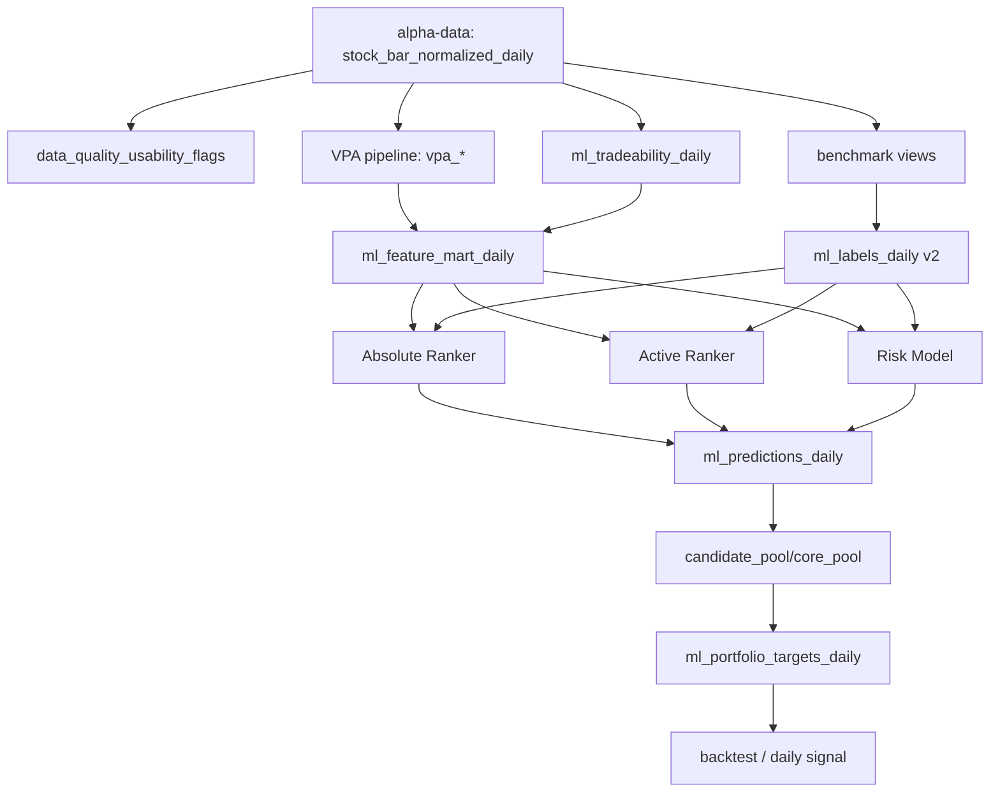
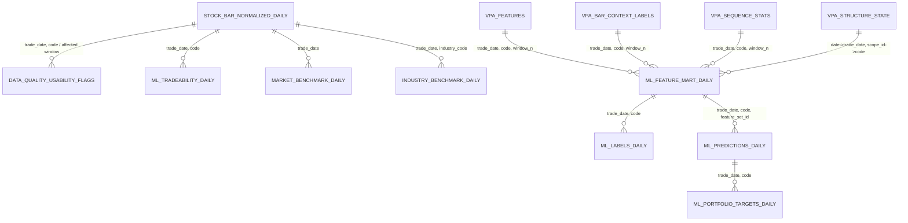

# 三模型量价学习规范说明

## 执行摘要

本规范建议把现有 VPA-ML 管线升级为**三模型设计**：`Absolute Ranker` 学习后续绝对收益排序，`Active Ranker` 学习相对市场/行业的主动收益排序，`Risk Model` 学习未来下行或失效风险；三者都只学习**量价与 VPA 状态**，**不把行业信息作为训练特征**。行业信息仅用于两类事情：一是定义 `industry_excess` / `active_score` 这样的**相对表现标签**，二是做组合构建时的**行业分散与 UNKNOWN 风险控制**。这一边界与两个仓库当前的职责边界是相容的：alpha-data 负责标准化 PIT 数据与质量标记，VPA 负责 `vpa_*` 派生表，ML 子系统只写 `ml_*` 表和模型工件。citeturn20view0turn16view1turn20view1turn20view2

现状上，`volume-price-analysis` 已具备 `ml_stock_selector` 子系统、`ml_feature_mart_daily` / `ml_labels_daily` / `ml_predictions_daily` 等表，以及基于 `LGBMRanker(objective="lambdarank", metric="ndcg")`、按 `trade_date` 横截面分组训练的基础排序器；但 `risk_model.py` 与 `alpha_regressor.py` 目前仍只是对 `alpha_ranker` 的薄包装，并不是真正独立的风险分类器或主动收益模型。与此同时，`ml_feature_mart_daily.features_json` 当前把 `industry_code` / `industry_name` 合并进 JSON，并额外写入 `industry_unknown`，这与“行业信息不进入训练特征”的目标相冲突。citeturn33view0turn35view0turn35view1turn37view1

因此，本规范的核心是：**不改动现有 alpha-data 主合同，不改动 VPA 主表含义，只通过 feature flag 增量增加 benchmark 视图、标签列、模型角色与打分逻辑**。默认行为保持现状；只有打开 `v2` 开关后，才启用“无行业特征 + 三模型 + 新 trade_score”的新方案。citeturn20view0turn37view2turn16view1

## 目标与原则

本次改造的唯一目标，是让机器学习尽量学习“**量价关系与 VPA 结构对后续收益/风险的规律**”，而不是学习“行业类别本身”。这与两个仓库当前的职责定义一致：alpha-data 只负责构建规范化源数据和质量标记，不生成未来收益标签、预测、组合、订单和 NAV；VPA 项目只消费上游准备好的 `stock_bar_normalized_daily`，然后写本项目拥有的 `vpa_*` 与 `ml_*` 结果。citeturn20view0turn16view1

三模型职责应明确切开：

| 模型 | 学习对象 | 训练标签 | 是否使用行业作特征 | 行业在该模型中的作用 |
|---|---|---|---|---|
| Absolute Ranker | 绝对收益强弱 | `absolute_rank_label` / 兼容旧 `rank_label` | 否 | 无 |
| Active Ranker | 独立于大盘/行业的主动收益 | `active_label` | 否 | 只参与定义 `industry_excess` / `active_score` |
| Risk Model | 下行/失效概率 | `risk_label` | 否 | 只参与组合层风险暴露控制 |

这一定义并不是否定行业的重要性，而是把行业信息**后移**：行业用于构造相对表现标签、用于持仓分散和 `UNKNOWN` 約束，而不是直接作为 one-hot 特征喂给模型。理由很简单：当前 `feature_mart.py` 会把 `industry_code` / `industry_name` 合入 `features_json`，`feature_matrix.py` 又会把非数值字段自动视作类别并 one-hot 编码；如果不改，这会让模型显式学习类别效应，而不是专注学习量价规律。citeturn37view1turn43view0turn43view2

最小破坏性原则如下：

1. **alpha-data 主合同不破坏**：`stock_bar_normalized_daily` 与 `data_quality_usability_flags` 语义保持不变；行业缺失仍标准化为 `industry_code='UNKNOWN'`、`industry_name='UNKNOWN'`。citeturn20view0turn25view4  
2. **VPA 主表不破坏**：现有 `vpa_features`、`vpa_bar_context_labels`、`vpa_sequence_stats`、`vpa_structure_state` 继续作为 ML 的唯一 VPA 特征来源。citeturn20view2turn49view0  
3. **ML 表优先“加列不改列”**：`ml_labels_daily`、`ml_predictions_daily` 以增量字段方式升级；旧字段继续保留。citeturn42view2turn42view3  
4. **所有行为变化都走 feature flag**：不开旗标时，仍允许现有单 Ranker / 旧打分 / 旧 daily signal 路径运行。当前组合层已允许 `allow_cash=True`、`min_trade_score=0.80`、`max_unknown_industry_names=1`，这些默认约束应保留。citeturn37view2turn33view7turn33view10  

## 仓库现状与改造清单

### 现状盘点

alpha-data 仓库当前对 ML/VPA 的直接暴露面主要包括：`docs/vpa_ml_consumer_contract.md`、`src/alpha_data_local/market_data_quality.py`、`src/alpha_data_local/research_source_contract.py`、`src/alpha_data_local/cli.py` 以及围绕行业、标准化 bar、质量可用性的测试。仓库目录中这些文件都已存在，且 CLI 已提供 `audit-market-data-quality` 与 `check-research-source-contract` 命令。citeturn15view1turn16view0turn23view6turn24view0

VPA 仓库当前包含 `vpa_structure_recognizer` 与下游 `ml_stock_selector` 两大部分；README 明确给出 ML 子系统的命令链，并说明它消费 alpha-data `stock_bar_normalized_daily` 与本仓库 `vpa_*` 表，只写 `ml_*` 表与模型工件。仓库还包含 `ml_stock_selector/contracts`、`models`、`portfolio`、`serving`、`sql/create_ml_tables.sql` 与相应测试。citeturn16view1turn17view0turn18view0turn18view1turn18view2turn30view0turn31view0

### alpha-data 改造清单

| 文件/表 | 变更类型 | 目的 | 回退策略 | 测试要点 | 当前依据 |
|---|---|---|---|---|---|
| `docs/vpa_ml_consumer_contract.md` | 文档更新 | 明确三模型边界：alpha-data 不产出标签/预测，但可**增量**提供 benchmark 视图；继续声明 `UNKNOWN` 为合法输出、`UNRESOLVED_ADJ_FACTOR_JUMP` 为高严重度隔离 | 保留旧字段与旧解释；新段落只对 `v2` 消费者生效 | 合同文档中写清 `absolute / active / risk` 仅属下游；`UNKNOWN` 与质量规则不变 | citeturn20view0 |
| `src/alpha_data_local/research_source_contract.py` | 代码+合同检查 | 保持 `stock_bar_normalized_daily` 必备列不变；为可选 `market_benchmark_daily` / `industry_benchmark_daily` 增加**软检查** | `--strict-benchmark-contract=false` 时忽略新增视图 | 缺少 benchmark 视图时给 warning 而非 error；旧库仍通过 | citeturn24view0 |
| `src/alpha_data_local/market_data_bootstrap.py` | 新增视图/表 | 增量构建 `market_benchmark_daily` 与 `industry_benchmark_daily`，避免下游重复做基准收益聚合；不改 `stock_bar_normalized_daily` | 通过 `enable_benchmark_views=false` 完全关闭 | benchmark 视图与源 bar 日期对齐；行业基准对 `UNKNOWN` 只观测、不作为真实行业基准 | `industry_classification_pit` 已在 bootstrap 中标准化导入，为构建行业 benchmark 提供基础。citeturn25view6 |
| `src/alpha_data_local/market_data_quality.py` | 文档/可选导出增强 | 保持现有可用性规则不变；允许额外导出“benchmark 计算应排除的样本”便捷视图 | flag 关闭时仅保留当前 `data_quality_usability_flags` | `MISSING_LIMIT` 仍可用于特征/标签但禁用于回测执行；`UNRESOLVED_ADJ_FACTOR_JUMP` 仍按 `affected_start / affected_end` 窗口隔离 | citeturn25view1turn25view0turn24view6turn25view4turn25view5 |
| `src/alpha_data_local/cli.py` | 新命令或新 flag | 为 benchmark 视图导出添加 CLI 入口；继续保留 `audit-market-data-quality` / `check-research-source-contract` | 新命令不调用即不改变现状 | CLI 帮助包含 flag；旧命令行为完全不变 | citeturn23view6 |
| `tests/test_data_quality_usability_flags.py` | 测试增强 | 锁定 `UNKNOWN`、`MISSING_LIMIT`、`UNRESOLVED_ADJ_FACTOR_JUMP` 的既有规则不被破坏 | 无 | `MISSING_INDUSTRY_CODE` 仍 LOW 且 `usable_for_ml_feature/label/backtest=True`；高严重度 issue 仍阻断 | `tests` 目录存在这些测试，且质量规则已在代码中定义。citeturn16view0turn25view4turn25view5 |
| `tests/test_industry_classification_contract.py` | 测试增强 | 锁定 `industry_name` 缺失时回退、`UNKNOWN` 标准化与 benchmark 视图的 `UNKNOWN` 处理 | 无 | `industry_name` 可缺失但合同不能破坏；`UNKNOWN` 不应被误当做数据坏点 | citeturn20view0turn24view0 |
| `tests/test_stock_bar_normalized_daily.py` | 测试增强 | 保证 benchmark 视图是**附加物**，不回写、不污染主表 | 无 | 新增视图前后，主表 schema 与示例数据不变 | `stock_bar_normalized_daily` 是当前下游主合同中心。citeturn20view0turn39view0 |

### VPA 与 VPA-ML 改造清单

| 文件/表 | 变更类型 | 目的 | 回退策略 | 测试要点 | 当前依据 |
|---|---|---|---|---|---|
| `docs/ml_stock_selector_operating_notes.md` | 文档更新 | 把现有“读 alpha-data + vpa_*，写 ml_*”的说明升级为三模型说明，明确行业**仅用于标签与组合约束** | 文档写清 `legacy_ranker_only` 路径仍可运行 | 新旧路径的命令顺序都可追溯 | citeturn20view1turn16view1 |
| `ml_stock_selector/feature_mart.py` | 关键代码修改 | 继续保留行级 `industry_code` / `industry_name` 元数据列，但**从 `features_json` 排除** `industry_code`、`industry_name`、`industry_unknown` | `exclude_industry_metadata_from_features_json=false` 时恢复旧行为 | `features_json` 不含行业字段；表级元数据仍完整；旧 VPA feature set 不受影响 | 当前代码把 `industry_code` / `industry_name` 合入 JSON，并写 `industry_unknown`。citeturn37view1turn28view5 |
| `ml_stock_selector/feature_matrix.py` | 关键代码修改 | 增加 denylist：即使旧 mart JSON 里有行业字段，`v2` 编码器也主动丢弃，彻底堵住行业 one-hot | `feature_matrix_v1=true` 时走旧编码 | 训练矩阵中不存在 `industry_*` 列；其余类别特征仍按 `__MISSING__` / `__UNKNOWN__` one-hot | 当前编码器会把非数值 JSON 字段自动当类别 one-hot。citeturn43view0turn43view2 |
| `ml_stock_selector/label_builder.py` | 关键代码修改 | 在现有 `future_ret/future_score/rank_label/risk_label` 基础上，新增 `market_ret`、`industry_ret`、`market_excess_ret`、`industry_excess_ret`、`active_score`、`active_rank_pct`、`active_label` 等 | `labels_v2_enabled=false` 时只写旧列 | 两个示例必须成立：市场同涨 5% 时 `market_excess≈0`；市场跌 3% 而个股涨 1% 时 `market_excess≈+4%` | 当前标签只含绝对收益、综合分、rank label、risk label。citeturn29view4turn28view0turn28view1turn28view3 |
| `sql/create_ml_tables.sql` | Schema 扩展 | 给 `ml_labels_daily` / `ml_predictions_daily` 加列，保留旧列不删；必要时增加 `ml_market_benchmark_daily` / `ml_industry_benchmark_daily` 物化表或视图脚本 | `schema_v2_enabled=false` 时只创建旧表 | 旧主键不变；新列可为 NULL；历史表可在线迁移 | 当前 `ml_labels_daily` 与 `ml_predictions_daily` 的字段仍是旧结构。citeturn42view2turn42view3 |
| `ml_stock_selector/data_access.py` | 代码增强 | 增加 benchmark / quality loader；继续从 alpha-data 读 `industry_code` / `industry_name` 作为元数据，不进入训练向量 | flag 关闭时不加载 benchmark | 缺 `industry_name` 时仍兼容；旧 normalized column 合同不变 | 当前 loader 读取的 normalized columns 已包括行业元数据。citeturn39view0 |
| `ml_stock_selector/models/alpha_ranker.py` | 轻改 | 保留为 Absolute Ranker；显式输出 `absolute_score`、`absolute_rank_pct`；`eval_at` 建议加到 10/15 | 不开 `train_absolute_ranker_v2` 时保留旧工件命名 | 按 `trade_date` 分组训练；输出 NDCG@10/15 与 RankIC | 当前实现已用 `LGBMRanker(objective="lambdarank", metric="ndcg")`，并按 `trade_date` 求 group。citeturn33view0turn47view0turn47view3 |
| `ml_stock_selector/models/active_ranker.py` | 新文件 | 新建 Active Ranker，结构可复用 `alpha_ranker.py`，但训练目标改为 `active_label` | `active_ranker_enabled=false` 时不训练 | 与 Absolute Ranker 同样按横截面 groups 训练，但标签不同 | 当前仓库无此文件；只是有 `alpha_regressor.py` 包装现有 ranker。citeturn30view0turn35view1 |
| `ml_stock_selector/models/risk_model.py` | 实质重写 | 改成真正二分类风险模型，输出 `risk_prob` / `risk_rank_pct`，评估 `ROC AUC` | `risk_model_v2_enabled=false` 时仍可回到旧包装器 | `risk_label` 为正类时 AUC 大于基准；概率单调性正确 | 当前 `risk_model.py` 只是调用 `train_alpha_ranker()` 的包装器。citeturn35view0turn46view2 |
| `ml_stock_selector/models/alpha_regressor.py` | 兼容处理 | 旧文件保留但标记 deprecated；不再是主路径 | `legacy_regressor_enabled=true` 时保留 | 不影响老 registry 读取 | 当前它也是 `train_alpha_ranker()` 的包装器。citeturn35view1 |
| `ml_stock_selector/scoring.py` | 关键代码修改 | 新 `trade_score` 以 `absolute_rank_pct + active_rank_pct - risk_rank_pct` 为核心；现有 context/liquidity 变成可选 overlay | `trade_score_v1=true` 回退现公式 | 新旧分数可并行写列对比 | 当前 `trade_score = 0.60*alpha_rank_pct + 0.15*context + 0.10*liquidity + 0.05*relative_strength + 0.10*resonance - 0.30*risk_rank_pct - penalty`。citeturn29view0 |
| `ml_stock_selector/portfolio/constraints.py` | 小改 | 保留 `allow_cash=True`、`min_trade_score=0.80`、`max_unknown_industry_names=1` 等默认；支持 core/candidate 两层池 | `portfolio_v1=true` 走旧逻辑 | 分数不足时允许空仓；UNKNOWN 上限仍生效 | citeturn37view2 |
| `ml_stock_selector/portfolio/constructor.py` | 小改 | 先构 candidate/core pool，再做行业分散；不建议做“三模型交集硬筛” | `portfolio_v1=true` 走旧构造 | 低分时可返回空组合；industry/UNKNOWN 约束稳定 | 当前已按 `trade_score` 排序，并限制行业与 UNKNOWN 数量。citeturn33view7turn33view8 |
| `ml_stock_selector/serving/daily_signal.py` | 关键代码修改 | 从“只加载 ranker”升级为“加载 Absolute + Active + Risk 三工件”，并写入新的 prediction 字段 | `daily_signal_v1=true` 保持旧行为 | 同日输出同时包含三模型分数和最终 trade_score | 当前 daily signal 只加载 `MODEL_TYPE_RANKER`。citeturn37view3 |
| `tests/test_ml_feature_mart.py` | 测试增强 | 锁定“行业元数据只在表列，不在 features_json” | 无 | `features_json` 无 `industry_code/name/industry_unknown` | 对应文件已存在。citeturn18view1turn37view1 |
| `tests/test_ml_label_builder.py` | 测试增强 | 验证 active label/benchmark 计算 | 无 | `market_excess`、`industry_excess`、`active_score` 算法正确 | 对应文件已存在。citeturn18view1turn29view4 |
| `tests/test_alpha_ranker.py` / `tests/test_ml_unknown_industry.py` / `tests/test_daily_signal.py` / `tests/test_portfolio_constructor.py` | 测试增强 | 锁定三模型输出、UNKNOWN 约束、空仓 gating | 无 | 新信号与旧路径可并跑对照 | 这些测试文件已存在。citeturn18view1 |

## 标签与特征设计

### 标签设计

现有 `ml_labels_daily` 是长表结构，主键为 `(trade_date, code, horizon_d, label_base)`，字段包括 `future_ret`、`future_score`、`future_rank_pct`、`rank_label`、`risk_label`、`outperform_market` 等。当前 `future_score` 由 `future_ret + 0.5*max_gain - 0.7*abs(max_drawdown)` 得到，`rank_label` 来自同日同 horizon 的百分位排序，`risk_label` 来自未来窗口最大回撤是否差过阈值。citeturn42view2turn29view4turn28view0

为了最小破坏，建议**保留现有长表与现有列**，再新增下表字段；其中 `absolute_*` 只是对现有绝对收益语义做显式命名，兼容原有 `future_*` / `rank_label` 逻辑。

| 字段名 | 类型 | 计算说明 | 兼容性说明 |
|---|---|---|---|
| `absolute_ret` | DOUBLE | `future_ret` 的显式别名，定义为从 `label_base` 到 horizon 末 `close` 的收益率 | 新增别名，旧 `future_ret` 保留 |
| `absolute_rank_pct` | DOUBLE | `absolute_ret` 或兼容旧 `future_score` 的横截面百分位；建议保留旧 `future_rank_pct`，并新增更清晰别名 | 新增别名 |
| `absolute_label` | INTEGER | 与 `rank_label` 同 bucket 规则；推荐直接与旧 `rank_label` 同义 | 新增别名 |
| `market_ret` | DOUBLE | 同 `trade_date/horizon_d/label_base` 的市场基准绝对收益；来源于 `market_benchmark_daily` 或全市场等权代理 | 新增 |
| `industry_ret` | DOUBLE | 同 `trade_date/horizon_d/label_base/industry_code` 的行业 peer-excluded 基准收益；`UNKNOWN` 或样本不足时为 NULL | 新增 |
| `market_excess_ret` | DOUBLE | `absolute_ret - market_ret` | 新增 |
| `industry_excess_ret` | DOUBLE | `absolute_ret - industry_ret` | 新增 |
| `active_score` | DOUBLE | 若行业基准可用：`0.5*market_excess_ret + 0.5*industry_excess_ret`；若不可用：退化为 `market_excess_ret` | 新增 |
| `active_rank_pct` | DOUBLE | 在 `(trade_date, horizon_d, label_base)` 横截面内对 `active_score` 做百分位排序 | 新增 |
| `active_label` | INTEGER | 由 `active_rank_pct` 落桶得到的排序标签 | 新增 |
| `benchmark_missing_market` | BOOLEAN | 市场基准缺失标记 | 新增 |
| `benchmark_missing_industry` | BOOLEAN | 行业基准缺失或 `industry_code='UNKNOWN'` 标记 | 新增 |
| `benchmark_peer_count` | INTEGER | 行业基准的可用 peer 数量；小于阈值则 `industry_ret=NULL` | 新增 |
| `risk_label` | INTEGER | 保持现逻辑：未来窗口最差回撤触发风险阈值即为 1 | 旧列保留 |

建议默认 `horizon_d` **继续兼容现有 `{1,5,10}`**，因为仓库常量当前就是 `DEFAULT_HORIZONS=[1,5,10]`；若进入 `v2`，可以把生产主 horizon 切到 `{5,10,20}`，但这不应在默认路径上强推。`feature windows` 则继续使用当前常量 `{5,10,20,60,120,240}`。citeturn44view0

### 特征设计

当前 `feature_mart.py` 已定义五档特征集：`baseline_a_ohlcv`、`baseline_b_vpa_numeric`、`vpa_c_bar_context`、`vpa_d_sequence`、`vpa_e_structure_state`，并把 OHLCV 特征、`vpa_features`、`vpa_bar_context_labels`、`vpa_sequence_stats`、`vpa_structure_state` 逐层合并。citeturn44view0turn48view4turn48view0turn48view3

`features_json` 在 `v2` 中应包含以下内容，但**明确不包含** `industry_code`、`industry_name`、`industry_unknown`：

| 特征簇 | 字段家族 | 窗口 | 说明 |
|---|---|---|---|
| OHLCV 衍生 | `ret_*`, `open_gap_pct`, `range_pct`, `body_pct`, `upper_shadow_pct`, `lower_shadow_pct`, `close_position`, `amount`, `turnover_rate`, `volatility_*`, `amount_ratio_*`, `volume_ratio_*`, `turnover_mean_*`, `high_distance_*`, `low_distance_*` | 5/10/20/60/120/240 | 来自 `ohlcv_features.py` 与 `OHLCV_FEATURE_PREFIXES` |
| VPA numeric | `ret_pct`, `range_pct`, `body_pct`, `vol_rvol_n`, `range_rvol_n`, `price_position_n`, `ma_slope_n` | 5/10/20/60/120/240 | 来自 `vpa_features` |
| Bar context | `raw_label`, `bull_bear_score`, `supply_score`, `demand_score`, `volatility_score` | 5/10/20/60/120/240 | 来自 `vpa_bar_context_labels` |
| Sequence | `abnormal_ratio`, `support_label_count`, `supply_label_count`, `bull_score_change`, `sequence_strength_score`, `sequence_pattern` | 5/10/20/60/120/240 | 来自 `vpa_sequence_stats` |
| Structure state | `final_state`, `final_rating`, `confidence`, `market_score`, `sector_score`, `self_score`, `relative_strength_score`, `resonance_score` | 当日态 | 来自 `vpa_structure_state` |

以上字段家族与当前代码中的列族常量是一致的。citeturn49view0turn49view1turn49view2turn49view3

### `feature_matrix` 编码规则

当前 `feature_matrix.py` 的规则是：先展开 `features_json`；数值、整数、布尔字段进 `numeric_columns`；其他字段进 `categorical_columns`；类别统一 one-hot，并自动补 `__MISSING__` / `__UNKNOWN__` 水位。这个总体规则可以保留，但要在 `v2` 加一个**行业字段 denylist**，确保即使旧 JSON 存在行业字段，训练矩阵也不纳入。citeturn43view0turn43view2

建议的 `v2` 规则如下：

| 规则 | 说明 |
|---|---|
| 数值列 | `int/float/bool` 直接转 `float`，缺失补 `0.0` |
| 类别列 | 非数值字符串列 one-hot；保留 `__MISSING__` / `__UNKNOWN__` |
| 强制排除列 | `industry_code`, `industry_name`, `industry_unknown`, 以及未来如有 `industry_level*` 列一律排除 |
| 输出顺序 | 固化在 `FeatureSchema.output_columns`，训练/推理一致 |
| 版本控制 | `feature_schema_version="v2_no_industry"`，与现有 `v1` 并存 |

## 训练推理与组合构建

### 三模型训练流程

当前 `alpha_ranker.py` 已经采用 `LGBMRanker(objective="lambdarank", metric="ndcg")`，并按 `trade_date` 对样本分组，group 大小之和等于样本数；LightGBM 官方文档也要求 learning-to-rank 的 `group` 满足 `sum(group)=n_samples`，并支持通过 `eval_at` 指定 NDCG 的评价位置。citeturn33view0turn47view0turn47view3

因此，三模型建议如下：

| 模型 | 训练目标 | 分组 | 建议损失/评价 | 输出字段 |
|---|---|---|---|---|
| Absolute Ranker | `absolute_label`（兼容旧 `rank_label`） | 按 `trade_date` 横截面 | `lambdarank` / `NDCG@10,@15`，外加 `RankIC` | `absolute_score_raw`, `absolute_rank_pct`, `absolute_zscore` |
| Active Ranker | `active_label` | 按 `trade_date` 横截面 | `lambdarank` / `NDCG@10,@15`，外加 `RankIC(active)` | `active_score_raw`, `active_rank_pct`, `active_zscore` |
| Risk Model | `risk_label` | 不分组或以 `trade_date` 做检验切片 | 二分类 `AUC`、PR-AUC（可选） | `risk_prob`, `risk_rank_pct`, `risk_zscore` |

这里的 `RankIC` 建议作为**项目内部横截面检验指标**：在每个 `trade_date` 上，计算模型得分与对应目标收益（如 `absolute_ret` 或 `active_score`）的秩相关，然后按时间求均值。仓库中尚未显式定义这一指标，因此本规范把它作为新增评价项，而不是宣称它已被实现。  

风险模型应输出概率，并以 `ROC AUC` 评估其排序能力；这与 `roc_auc_score` 的定义相容。citeturn46view2

### 推理与标准化

推理阶段建议所有模型都输出两套标准化：

| 字段 | 标准化方式 | 用途 |
|---|---|---|
| `*_rank_pct` | 按 `trade_date` 横截面百分位，范围 `[0,1]` | 组合打分与阈值筛选 |
| `*_zscore` | 按 `trade_date` 横截面 z-score，可 winsorize 到 `[-3,3]` | 多模型线性融合与监控 |

推荐的 `ml_predictions_daily` 扩展字段如下：

| 字段 | 类型 | 说明 |
|---|---|---|
| `absolute_score` | DOUBLE | Absolute Ranker 原始输出 |
| `absolute_rank_pct` | DOUBLE | 横截面排名百分位 |
| `active_score` | DOUBLE | Active Ranker 原始输出 |
| `active_rank_pct` | DOUBLE | 横截面排名百分位 |
| `risk_prob` | DOUBLE | 风险模型概率输出 |
| `risk_rank_pct` | DOUBLE | 横截面风险百分位，越大越危险 |
| `core_score` | DOUBLE | 仅三模型综合分 |
| `trade_score_v2` | DOUBLE | 三模型 + 流动性/执行 overlay 后的最终交易分 |
| `score_version` | VARCHAR | `v1_legacy` / `v2_three_model` |

### 组合构建与约束

当前仓库已存在组合约束默认值：`target_positions=12`、`hard_max_positions=15`、`max_industry_names=3`、`max_unknown_industry_names=1`、`min_trade_score=0.80`、`allow_cash=True`；组合构造器按 `trade_score` 排序，受行业与 UNKNOWN 限制。citeturn37view2turn33view7turn33view8

在三模型下，建议引入两层股票池：

| 池 | 定义 | 示例阈值 |
|---|---|---|
| `candidate_pool` | 先过硬过滤：非 ST、非停牌、`can_buy_next_open=True`、流动性达标、质量标志允许；再要求至少一个 Alpha 维度不差 | `absolute_rank_pct>=0.70` **或** `active_rank_pct>=0.70`，且 `risk_rank_pct<=0.60` |
| `core_pool` | 作为最终选股候选，要求绝对收益、主动收益、风险三者同时达标 | `absolute_rank_pct>=0.80`，`active_rank_pct>=0.75`，`risk_rank_pct<=0.35`，`trade_score_v2>=0.80` |

推荐的核心打分公式为：

```text
core_score
= 0.50 * absolute_rank_pct
+ 0.35 * active_rank_pct
- 0.15 * risk_rank_pct
```

若仍要保留当前 VPA 上下文/流动性 overlay，则新增：

```text
trade_score_v2
= core_score
+ 0.10 * liquidity_score_pct
+ overlay_context
- penalty_score
```

其中 `overlay_context` 建议默认关闭，或仅保留**不含行业类别本身**的 VPA 结构上下文。当前旧公式可并行保留为 `trade_score_v1` 以做回测对照。citeturn29view0

### 空仓与仓位 gating

你之前担心“新算法下还能否空仓”，答案是：**不仅能，而且应当继续保留**。因为当前约束层已经有 `allow_cash=True` 与 `min_trade_score=0.80`。三模型上云以后，空仓 gating 更有意义：当绝对收益不错但主动收益弱、或风险概率过高时，不应强迫买入。citeturn37view2

建议的 gating 逻辑：

1. `candidate_pool` 数量低于 `5`，空仓。  
2. `core_pool` 数量为 `0`，空仓。  
3. `core_pool` 中位数 `trade_score_v2 < 0.80`，空仓。  
4. 当日 `INCOMPLETE_TRADING_DATE` 或高严重度质量问题污染基准/标签时，空仓。  
5. 若 `UNKNOWN` 候选虽然高分，但 `max_unknown_industry_names` 已满，则不纳入。  

### 每日选股流程



上图与当前仓库中的主流程边界一致：alpha-data 提供 normalized bars 与质量标记；VPA 提供 `vpa_*`；ML 子系统落 `ml_*` 表。citeturn20view0turn16view1turn20view1

## 数据流、表关联与关键 join

### 数据流与 ER 关系



### 关键 join 规则

| 上游 | 下游 | Join keys | 时间窗口 | 说明 |
|---|---|---|---|---|
| `stock_bar_normalized_daily` | `data_quality_usability_flags` | `code` + `trade_date BETWEEN affected_start AND affected_end` | issue 窗口 | `UNRESOLVED_ADJ_FACTOR_JUMP` 必须按影响窗口隔离，不是只看单日 | `affected_start/affected_end` 当前已输出。citeturn25view0 |
| `stock_bar_normalized_daily` | `ml_tradeability_daily` | `trade_date, code` | 20 日 ADV | 当前 tradeability mart 已生成 `adv20_amount`、`next_open`、`next_limit_*`、`can_buy_next_open` 等 | citeturn29view1turn42view0 |
| `vpa_features` | `ml_feature_mart_daily` | `trade_date, code, window_n` | 5/10/20/60/120/240 | VPA 数值列按窗口 pivot | citeturn49view0 |
| `vpa_bar_context_labels` | `ml_feature_mart_daily` | `trade_date, code, window_n` | 5/10/20/60/120/240 | 上下文状态按窗口 pivot | citeturn49view1 |
| `vpa_sequence_stats` | `ml_feature_mart_daily` | `trade_date, code, window_n` | 5/10/20/60/120/240 | 序列统计按窗口 pivot | citeturn49view2 |
| `vpa_structure_state` | `ml_feature_mart_daily` | `date -> trade_date`, `scope_id -> code`, `scope_type='stock'` | 当日态 | 结构状态不走窗口 pivot | citeturn48view3 |
| `market_benchmark_daily` | `ml_labels_daily` | `trade_date, horizon_d, label_base` | label horizon | 生成 `market_ret` 与 `market_excess_ret` | 该视图为本规范新增 |
| `industry_benchmark_daily` | `ml_labels_daily` | `trade_date, industry_code, horizon_d, label_base` | label horizon | 生成 `industry_ret` 与 `industry_excess_ret`；`UNKNOWN` 不作为真实行业 benchmark | `UNKNOWN` 在当前系统中只用于中性上下文和组合限制。citeturn20view2turn20view1 |

## 兼容性、测试与部署

### 兼容性与 feature flag

建议的旗标设计如下：

| Flag | 默认值 | 作用 |
|---|---|---|
| `alpha_data.enable_benchmark_views` | `false` | 是否在 alpha-data 产出 benchmark 视图 |
| `ml.exclude_industry_metadata_from_features_json` | `false` | 是否从 `features_json` 剔除行业字段 |
| `ml.feature_matrix_v2_deny_industry` | `false` | 是否在编码层强制丢弃行业字段 |
| `ml.labels_v2_enabled` | `false` | 是否写入 `market_excess` / `industry_excess` / `active_*` 标签 |
| `ml.active_ranker_enabled` | `false` | 是否训练/推理 Active Ranker |
| `ml.risk_model_v2_enabled` | `false` | 是否使用真正二分类 Risk Model |
| `ml.trade_score_v2_enabled` | `false` | 是否用三模型综合分替代旧 `trade_score` |
| `ml.daily_signal_v2_enabled` | `false` | 是否在 daily signal 中加载三工件 |

`compute_start` / `output_start` 继续沿用渐进部署思路：因为最大特征窗口是 240，`compute_start` 至少应比 `output_start` 提前约 240 个交易日；若还要稳妥生成 20 日以上标签，建议预留 260 个交易日以上 warm-up。当前常量里的默认 feature windows 已经是 `5/10/20/60/120/240`。citeturn44view0

### 测试与验收清单

#### alpha-data

```bash
python -m pytest tests/test_data_quality_usability_flags.py -v
python -m pytest tests/test_industry_classification_contract.py -v
python -m pytest tests/test_stock_bar_normalized_daily.py -v
python -m alpha_data_local audit-market-data-quality --source-db output/research_source.duckdb --output output/quality.json
python -m alpha_data_local check-research-source-contract --db output/research_source.duckdb
```

alpha-data CLI 已明确提供 `audit-market-data-quality` 与 `check-research-source-contract`。citeturn23view6turn24view0

关键断言：

- `MISSING_INDUSTRY_CODE` 仍是 LOW，且 `usable_for_ml_feature=True`、`usable_for_ml_label=True`、`usable_for_backtest=True`。citeturn25view4  
- `UNRESOLVED_ADJ_FACTOR_JUMP`、`INCOMPLETE_TRADING_DATE` 仍不可用于 VPA/ML/backtest。citeturn25view5turn20view0  
- `industry_code='UNKNOWN'` / `industry_name='UNKNOWN'` 仍为标准化输出。citeturn20view0  
- 若启用 benchmark 视图，它们是附加输出，不改变 `stock_bar_normalized_daily` 主表。  

#### VPA / VPA-ML

```bash
python -m pytest tests/test_ml_feature_mart.py -v
python -m pytest tests/test_ml_label_builder.py -v
python -m pytest tests/test_alpha_ranker.py -v
python -m pytest tests/test_ml_unknown_industry.py -v
python -m pytest tests/test_daily_signal.py -v
python -m pytest tests/test_portfolio_constructor.py -v
python scripts/run_ml_feature_mart.py --config config/ml_default.toml
python scripts/build_ml_labels.py --config config/ml_default.toml
python scripts/train_ml_models.py --config config/ml_default.toml
python scripts/run_ml_batch_predict.py --config config/ml_default.toml
python scripts/run_ml_backtest.py --config config/ml_default.toml
python scripts/run_ml_daily_signal.py --config config/ml_default.toml --as-of-date YYYY-MM-DD
```

这些命令链已在 README 中给出，`build_ml_labels.py` 的当前实现也确实是“读 normalized bars → build labels → upsert 到 `ml_labels_daily`”。citeturn16view1turn36view1

新增/强化的关键断言：

- **无行业特征**：`ml_feature_mart_daily.features_json` 不包含 `industry_code`/`industry_name`/`industry_unknown`；`build_feature_matrix()` 输出列中不存在任何 `industry_*`。当前之所以必须加这条，是因为现实现将行业写入 JSON，而编码器会自动做类别 one-hot。citeturn37view1turn43view0turn43view2  
- **主动收益标签正确**：构造 fixture，令 A 股 5 日绝对收益 5%、市场 5%，B 股 5 日绝对收益 1%、市场 -3%，则 `A.market_excess_ret≈0`，`B.market_excess_ret≈+4%`。  
- **UNKNOWN 可训练但受组合约束**：UNKNOWN 样本可出现在 feature mart 和 labels 中，但组合最多持有 `max_unknown_industry_names` 只，默认仍为 1。citeturn20view1turn37view2turn33view7  
- **可空仓**：`trade_score_v2` 不达阈值时，`ml_portfolio_targets_daily` 可以为空，且这是正常行为。当前 `allow_cash=True` 已支持这种策略形态。citeturn37view2  
- **Risk Model 是真分类器**：预测结果包含 `risk_prob`，并以 `ROC AUC` 验收，而不是只复用 ranker 工件。citeturn35view0turn46view2  

### 部署与运行建议

调度顺序建议如下：

1. alpha-data 构建 `research_source.duckdb`。  
2. alpha-data 质量审计 / 合同检查通过。  
3. VPA 结构识别，产出 `vpa_*`。  
4. 生成 `ml_tradeability_daily`。  
5. 生成 `ml_feature_mart_daily`。  
6. 生成 `ml_labels_daily v2`。  
7. 训练并注册三模型。  
8. 批量预测。  
9. 组合构建 / 回测 / 日信号。  

这与 README 里现有命令顺序是一致的，只是把训练步骤从“单 ranker + 包装 risk/regressor”扩展成真三模型。citeturn16view1turn20view1turn35view0turn35view1

运行时监控建议至少包括：

- `unknown_industry_ratio`  
- `missing_limit_count`、`unresolved_adj_factor_jump_count`、`incomplete_trading_date_count`  
- `candidate_pool_size`、`core_pool_size`、`cash_days_ratio`  
- `NDCG@10`、`NDCG@15`、`RankIC`、`ROC AUC`  
- `feature_drift`（按训练 schema 的列分布监控）  

质量门控方面：

- `UNRESOLVED_ADJ_FACTOR_JUMP`：对 `affected_start~affected_end` 全窗口做硬阻断。citeturn20view0turn25view0  
- `INCOMPLETE_TRADING_DATE`：整日横截面阻断。citeturn20view0turn25view5  
- `MISSING_LIMIT`：允许做特征/标签，但回测和执行必须保守，且导出的 `can_buy_next_open` / `can_sell_next_open` 在下个涨跌停缺失时必须为 `false`。citeturn20view0  
- `MISSING_INDUSTRY_CODE` / `UNKNOWN`：允许特征、标签、训练、评分；但组合单独限额并单独汇报风险暴露。citeturn20view1turn20view2turn25view4  

## 附录

### 生成标签的示例 SQL / 伪代码

```sql
-- 伪代码：生成绝对/市场/行业/主动标签
with base as (
    select
        b.trade_date,
        b.code,
        b.industry_code,
        l.horizon_d,
        l.label_base,
        l.absolute_ret,
        l.future_max_gain,
        l.future_max_drawdown
    from stock_future_return_snapshot l
    join stock_bar_normalized_daily b
      on b.trade_date = l.trade_date and b.code = l.code
),
mkt as (
    select trade_date, horizon_d, label_base, market_ret
    from market_benchmark_return_daily
),
ind as (
    select trade_date, industry_code, horizon_d, label_base, industry_ret, peer_count
    from industry_benchmark_return_daily
)
select
    base.*,
    mkt.market_ret,
    ind.industry_ret,
    base.absolute_ret - mkt.market_ret as market_excess_ret,
    case
      when ind.industry_ret is null then null
      else base.absolute_ret - ind.industry_ret
    end as industry_excess_ret,
    case
      when ind.industry_ret is null
        then base.absolute_ret - mkt.market_ret
      else 0.5 * (base.absolute_ret - mkt.market_ret)
         + 0.5 * (base.absolute_ret - ind.industry_ret)
    end as active_score,
    case when base.future_max_drawdown <= -0.05 then 1 else 0 end as risk_label
from base
left join mkt
  on mkt.trade_date = base.trade_date
 and mkt.horizon_d = base.horizon_d
 and mkt.label_base = base.label_base
left join ind
  on ind.trade_date = base.trade_date
 and ind.industry_code = base.industry_code
 and ind.horizon_d = base.horizon_d
 and ind.label_base = base.label_base;
```

### 生成特征 join 的示例 SQL / 伪代码

```sql
-- 伪代码：feature mart 元数据与训练特征分离
select
    t.trade_date,
    t.code,
    :feature_set_id as feature_set_id,
    t.industry_code,
    t.industry_name,
    t.is_st,
    t.is_paused,
    t.limit_up,
    t.limit_down,
    t.adv20_amount,
    t.can_buy_next_open,
    t.can_sell_next_open,
    json_object(
        -- 仅写 OHLCV + VPA family
        'ret_5', f.ret_5,
        'ret_pct_5', v.ret_pct_5,
        'raw_label_5', c.raw_label_5,
        'sequence_pattern_20', s.sequence_pattern_20,
        'final_state', st.final_state
        -- 不写 industry_code / industry_name / industry_unknown
    ) as features_json
from ml_tradeability_daily t
left join ohlcv_feature_wide f
  on f.trade_date = t.trade_date and f.code = t.code
left join vpa_numeric_wide v
  on v.trade_date = t.trade_date and v.code = t.code
left join vpa_context_wide c
  on c.trade_date = t.trade_date and c.code = t.code
left join vpa_sequence_wide s
  on s.trade_date = t.trade_date and s.code = t.code
left join vpa_structure_state_daily st
  on st.trade_date = t.trade_date and st.code = t.code;
```

### `trade_score` 的示例伪代码

```python
def score_v2(df):
    df["core_score"] = (
        0.50 * df["absolute_rank_pct"]
        + 0.35 * df["active_rank_pct"]
        - 0.15 * df["risk_rank_pct"]
    )

    df["trade_score_v2"] = (
        df["core_score"]
        + 0.10 * df.get("liquidity_score_pct", 0.5)
        - df.get("penalty_score", 0.0)
    )
    return df
```

### `core_pool` / `candidate_pool` 的示例伪代码

```python
def build_pools(df, min_adv20, min_trade_score=0.80):
    hard = df[
        (~df["is_st"].fillna(False))
        & (~df["is_paused"].fillna(False))
        & (df["can_buy_next_open"].fillna(False))
        & (df["adv20_amount"].fillna(0.0) >= min_adv20)
    ].copy()

    candidate = hard[
        ((hard["absolute_rank_pct"] >= 0.70) | (hard["active_rank_pct"] >= 0.70))
        & (hard["risk_rank_pct"] <= 0.60)
    ].copy()

    core = candidate[
        (candidate["absolute_rank_pct"] >= 0.80)
        & (candidate["active_rank_pct"] >= 0.75)
        & (candidate["risk_rank_pct"] <= 0.35)
        & (candidate["trade_score_v2"] >= min_trade_score)
    ].copy()
    return candidate, core
```

### 逐步迁移计划

| 阶段 | 优先级 | 动作 |
|---|---|---|
| 短期 | P0 | 先做 `feature_mart.py` 与 `feature_matrix.py` 的“无行业特征”改造；同时给 `label_builder.py` 增加 `market_excess` / `industry_excess` / `active_*` 标签；保持旧模型与旧打分仍可运行 |
| 中期 | P1 | 新增 `active_ranker.py`，把 `risk_model.py` 改为真分类器；扩展 `create_ml_tables.sql`、`daily_signal.py`、`scoring.py`、`portfolio` 流程；新旧 trade score 并跑对比 |
| 长期 | P2 | 若 benchmark 视图在 alpha-data 稳定后，再把行业/市场 benchmark 聚合上收至 alpha-data；补全 `train_ml_models.py` / `run_ml_batch_predict.py` / `run_ml_backtest.py` 的三模型注册与监控自动化 |

### Open questions / limitations

- `scripts/train_ml_models.py`、`scripts/run_ml_batch_predict.py`、`scripts/run_ml_backtest.py` 的**具体实现细节**本次未完整展开核对；本规范对这些脚本的改造建议主要依据 README 的命令链和已核实的 `daily_signal.py`、model/storage/schema 代码，因此具体参数装配细节应标记为“未指定”。citeturn16view1turn37view3turn40view3  
- alpha-data 当前是否已有可直接复用的市场 benchmark 物化视图，在仓库中**未明确指定**；因此本文把它定义为“附加、可选、flag 控制”的上游增量能力，而不是既有能力。  
- VPA 表的完整物理 schema（尤其 `vpa_features` / `vpa_bar_context_labels` / `vpa_sequence_stats` 的所有非核心列）并未全部展开，本规范只依据 `feature_mart.py` 中明确写出的列族与读取逻辑定义训练特征范围。citeturn49view0turn49view1turn49view2